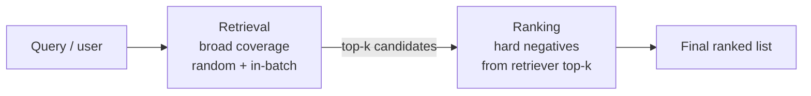

---
aliases:
  - negative sampling
tags:
  - recsys
  - concept
  - embeddings
---
Negative sampling trains a model by contrasting each observed positive with a small set of sampled alternatives instead of every item in the catalog. For some losses this approximates a full softmax or pairwise objective; for others (SGNS, BCE with sampled negatives) it defines the objective directly. The approach keeps training cost manageable for catalogs with millions of items.

The technique was popularized by [Mikolov et al. (2013)](https://arxiv.org/abs/1310.4546) for Word2Vec as a simplified variant of noise contrastive estimation (NCE, [Gutmann & Hyvärinen 2010](https://proceedings.mlr.press/v9/gutmann10a.html)); contrastive estimation against a noise distribution predates that. It is widely used across NLP embeddings, [[Recommendation system|recommendation systems]], [[Two-tower]] retrieval, contrastive representation learning, and knowledge-graph embeddings.

## Why sampling

A full softmax over millions of items costs $O(|\text{catalog}|)$ per training step. Implicit-feedback systems also only observe positive interactions (clicks, plays, purchases). Treating every non-interacted pair as a negative inflates label noise; most resulting gradients carry little signal.

Sampled negatives give a contrastive signal at a fraction of the compute. For a positive pair $(u, i^+)$ scored against $K$ sampled negatives $\{i_k^-\}$ drawn uniformly, the sampled-softmax form is:

$$\mathcal{L} = -\log \frac{\exp(s_{u, i^+})}{\exp(s_{u, i^+}) + \sum_{k=1}^{K} \exp(s_{u, i_k^-})}$$

When the sampled-softmax form is meant to approximate the full softmax under a non-uniform sampling distribution $Q$, the uncorrected estimator is biased: items frequently sampled as negatives have their scores systematically suppressed. The importance-sampling correction ([Bengio & Senécal 2008](https://ieeexplore.ieee.org/document/4443871); standard in [[Two-tower]] retrieval after [Yi et al. 2019](https://dl.acm.org/doi/10.1145/3298689.3346996)) subtracts $\log Q$ from each logit:

$$\mathcal{L} = -\log \frac{\exp(s_{u, i^+} - \log Q(i^+))}{\exp(s_{u, i^+} - \log Q(i^+)) + \sum_{k=1}^{K} \exp(s_{u, i_k^-} - \log Q(i_k^-))}$$

This is the [[logQ correction]]. Pairwise BPR, BCE, SGNS, and similar binary or pairwise objectives do not approximate a full softmax and do not need the same correction; they have their own calibration concerns.

Two consequences of sampling regardless of the loss: the gradient becomes a higher-variance estimator, and the sampling distribution shapes which contrasts the loss exposes.

## Origins

NCE recasts density estimation as a logistic-regression problem against a known noise distribution, with the partition function as a learned parameter. Skip-Gram with Negative Sampling (SGNS) drops the partition-function term and trains a binary classifier between observed (word, context) pairs and (word, sampled noise) pairs:

$$\mathcal{L}_{\text{SGNS}} = -\log \sigma(s_{w, c^+}) - \sum_{k=1}^{K} \log \sigma(-s_{w, c_k^-})$$

The sampled-softmax and the SGNS binary version share the negative-sampling idea, but are different objectives and produce different gradients. Many large-scale two-tower retrieval systems use sampled-softmax objectives; modern visual contrastive learning uses InfoNCE; classical Word2Vec used SGNS. Mikolov drew negatives from a unigram-to-the-3/4 distribution and reports better analogy-task accuracy than unigram and uniform alternatives.

![[negative_sampling_sgns_vs_softmax.excalidraw.light.svg]]

[Goldberg & Levy (2014)](https://arxiv.org/abs/1402.3722) derive the SGNS objective. [Levy & Goldberg (NeurIPS 2014)](https://arxiv.org/abs/1405.4053) show it implicitly factorizes the shifted pointwise mutual information (PMI) matrix $\text{PMI}(w, c) - \log K$, where $K$ is the number of sampled negatives; the negatives count directly controls the shift.

## Applications

The sampling-and-contrastive recipe shows up across embedding-learning settings:

- Word embeddings: SGNS for Word2Vec, the original use; negatives drawn from the unigram-to-3/4 distribution.
- Collaborative filtering: [[Neural Collaborative Filtering]] uses sampled negatives with binary cross-entropy; [[Two-tower]] retrievers use sampled softmax with [[logQ correction]].
- Visual and multimodal contrastive learning: [SimCLR](https://arxiv.org/abs/2002.05709) and CLIP treat in-batch alternatives as negatives.
- Dense text retrieval: [Dense Passage Retrieval](https://arxiv.org/abs/2004.04906) trains BERT-based dual encoders with offline ANN-mined hard negatives drawn from the previous model's top-k.
- Sequential and session-based recommendation: SASRec, BERT4Rec, and HSTU sample alternative next-items as negatives; the "negative" is a plausible-but-wrong continuation of the session rather than an unrelated item.
- Metric learning and knowledge-graph embeddings: triplet and pairwise losses where negatives shape the embedding geometry (TransE, DistMult, and their successors).

## Sampling strategies

Strategies differ mainly in the negative distribution $Q(j)$.

![[negative_sampling_long_tail_samplers.excalidraw.light.svg]]

### Random / uniform

A negative is drawn uniformly from the catalog. Cheap and easy to reason about, but produces mostly easy negatives that contribute weak gradients. Reinforces popularity bias in practice ([Prakash et al. 2024](https://arxiv.org/abs/2410.17276)): positives are head-heavy while uniform negatives are mostly tail items, so head-vs-head discrimination receives little training signal.

### Popularity-based

Negatives are drawn proportional to the power of item frequency. Word2Vec used $Q(j) \propto f(j)^{0.75}$. Popular items are more likely to be informative negatives because the user had exposure to them but did not interact, making them plausible counterexamples. When used as a sampled-softmax approximation, this requires [[logQ correction]] to keep score calibration correct.

### In-batch

Within a mini-batch of $N$ (user, positive item) pairs, each user's positive serves as the negative for every other user. Compute cost is negligible and the step yields $N(N-1)$ implicit negatives. The in-batch distribution mirrors training-data popularity, so popular items are over-represented as negatives. [Yi et al. (2019)](https://dl.acm.org/doi/10.1145/3298689.3346996) introduced the sampling-bias correction now standard for in-batch softmax in [[Two-tower]] retrieval.

![[negative_sampling_in_batch_mask.excalidraw.light.svg]]

This illustration demonstrates the accidental-hits problem: when two batch entries share an item ID (item A appears for both users 0 and 3 above), the off-diagonal cells where the column item equals another row's positive are false negatives — addressed in the [[#Accidental hits]] subsection below.

### Hard negatives

Negatives are biased toward items the model currently scores high but which are not positives ([Zhang et al. 2013](https://wnzhang.net/papers/lambdarankcf-sigir.pdf)). Hard negatives sharpen the decision boundary and improve top-k metrics. Common sources:

- Similarity-based: items with high embedding similarity to the positive but no positive interaction (often the same category, brand, or price range).
- Ranking-based: items ranked just below the positive in an initial retrieval pass; the standard hard-negative source in two-stage retrieval is positions 100–500 of the retriever's own output.
- ANN-mined: a previous-version model builds a FAISS or ScaNN index, retrieves the top-$N$ for each user, excludes the true positive, and freezes the remainder as the next epoch's hard set. Standard in DPR-style text retrieval; refreshed every few epochs.
- Cross-batch memory ([Wang et al. 2020](https://arxiv.org/abs/1912.06798)): a queue of embeddings from previous batches, exposing the model to items not in the current minibatch.
- Momentum queue ([He et al. 2020](https://arxiv.org/abs/1911.05722) for MoCo): a slowly-updated momentum encoder maintains a long FIFO queue of past embeddings as negatives, decoupling queue size from batch size at the cost of a small staleness bias.

The metric-learning vocabulary (anchor / positive / negative triplets, hard / semi-hard / easy negatives in the FaceNet sense) maps onto the same structural choices under different names.

![[negative_sampling_embedding_zones.excalidraw.light.svg]]

The trade-offs: training is less stable, false negatives are more likely to be sampled, and the candidate set needs periodic refresh because what counts as "hard" shifts during training. Mining hard negatives from the current model can amplify the model's own biases: items the model already misranks tend to be selected as hard negatives epoch after epoch, repeatedly punishing ambiguous positives. Pushing too aggressively can collapse representations into a tight cone, where positive and negative scores converge and gradients vanish. [Shi et al. (2023)](https://arxiv.org/abs/2302.03472) connect Bayesian Personalized Ranking (BPR) with dynamic negative sampling to partial-AUC optimization, linking hard-negative gains to top-k retrieval performance.

### Exposure-based

A negative is restricted to items the user actually saw but did not click. These are "exposed non-positives" rather than confirmed negatives: position, attention, UI layout, and the serving policy all confound the negative signal. Useful as a complement to other strategies, rarely sufficient alone; the propensity machinery that makes exposure-based negatives less biased is shared with [[Counterfactual evaluation]].

### Mixed strategies

Production retrievers usually combine strategies: a base of in-batch or random negatives plus a small fraction of hard negatives. [Fan et al. (2023)](https://dl.acm.org/doi/10.1145/3583780.3614789) report a 100:1 random-to-hard ratio with hard items drawn from rank positions 100–500, and find that pure hard-negative training underperforms random sampling alone. The mix balances coverage and difficulty. Curriculum schedules vary the mix over training time rather than across each batch: start with random or popularity-weighted negatives, then ramp the hard-negative fraction over epochs. This stabilizes training when pure hard-negative sampling is too noisy from epoch one.

### Trade-off summary

| Strategy | Compute / memory | Gradient variance | False-negative risk | Calibration |
|---|---|---|---|---|
| Random / uniform | low | high | low | clean prior shift |
| Popularity-weighted | low | medium | low–medium | non-uniform $Q$; logQ correction for sampled softmax |
| In-batch | negligible extra | medium | medium (accidental hits) | logQ correction for sampled softmax |
| ANN-mined hard | high (periodic index build) | low | high | recalibrate on production-like val |
| Cross-batch memory | medium (queue storage) | low | high | recalibrate |
| Momentum contrast | medium–high (queue + momentum encoder) | low | high | recalibrate |
| Exposure-based | medium | medium | low | inherits serving-policy bias |

## Bias and false negatives

### Popularity bias

Item popularity interacts with sampling in several ways. Positive interactions are head-biased because popular items receive more exposure; random negative sampling pulls mostly tail items, leaving head-vs-head discrimination under-trained. Popularity-weighted sampling shifts mass toward head items as negatives, at the cost of needing [[logQ correction]] for sampled-softmax objectives. In-batch sampling follows the positive distribution and inherits its head-heaviness.

### False negatives

Implicit feedback contains true negatives (genuine disinterest) and false negatives (relevant items the user never saw). Sampling treats both as negatives, biasing the loss. Mitigations:

- Skip items the user has already interacted with (basic but essential).
- Two-stage filtering: candidate generation produces a relevant set, and sampled negatives are drawn from the complement.
- Variance-based filtering: true negatives converge to low scores during training; false negatives continue to receive high scores. Items with low loss variance after several epochs can be flagged as candidate false negatives ([Ma et al. 2024](https://arxiv.org/abs/2409.07237)).

### Accidental hits

In in-batch sampling, two batch entries can share the same item ID (user A and user B both clicked item X). The matrix multiplication then penalizes user A against user B's copy of item X as a negative, guaranteeing a false-negative loss on the most popular items. The fix is an ID-equality mask applied to the logit matrix before the softmax, with the true-positive diagonal preserved. Near-duplicate items, item variants, items from the same creator or product family, and repeated content can produce the same kind of false negative even when the IDs differ; the mask widens to a similarity- or family-based equivalence relation where appropriate. After [[logQ correction]], this is the most consequential in-batch correction.

### Calibration

Sampled negatives change the effective training prevalence. A model trained at one positive per ten sampled negatives produces probabilities calibrated to the 1:10 distribution, not the real rate. The fix is prior correction. Sampling that depends on item features (popularity-weighted, hard-negative) is not a pure prior shift; recalibration on a production-like validation set is the safer path. See [[Calibration]] for the formal correction. (Pairwise BPR is exempt from this framing: its output is a ranking score, not a probability, so calibration to the sampling ratio does not apply.)

## Loss formulations

Negative sampling is loss-agnostic; the same sampling distribution can be applied to different losses.

- Pairwise BPR ([Rendle et al. 2009](https://arxiv.org/abs/1205.2618)): $-\log\sigma(s_{u,i^+} - s_{u,i^-})$ over (user, positive, sampled negative) triplets. Optimizes pairwise rank correctness directly.
- Binary cross-entropy: each (user, item) pair as a 0/1 classification with sampled negatives. Standard in [[Neural Collaborative Filtering]].
- Sampled softmax: log-likelihood of the positive against a softmax over the positive plus sampled negatives. Standard in [[Two-tower]] retrieval; needs [[logQ correction]] when the sampling distribution is biased.
- InfoNCE / contrastive: temperature-scaled softmax with in-batch alternatives as negatives ([Chen et al. 2020](https://arxiv.org/abs/2002.05709) for SimCLR). A lower temperature $\tau < 1$ sharpens the softmax and concentrates gradient on the hardest negatives in the batch; in InfoNCE-style objectives, temperature can matter as much as the choice of sampling distribution.

The choice between pairwise and listwise depends on the metric being optimized. BPR optimizes pairwise rank correctness; sampled softmax targets the log-probability of the positive within a candidate set and aligns more closely with top-k retrieval objectives.

## Practical considerations

- SGNS counts: Mikolov 2013 recommends 5–20 negatives per positive for small datasets and 2–5 for larger ones.
- Two-tower retrieval typically uses several hundred to a few thousand in-batch negatives ([Yi et al. 2019](https://dl.acm.org/doi/10.1145/3298689.3346996) test batch sizes up to 8192).
- InfoNCE and sampled-softmax setups should L2-normalize embeddings before the dot product; otherwise the network can minimize loss by inflating embedding magnitude rather than aligning direction, and the temperature loses its intended meaning.
- Retrieval and ranking stages want different sampling distributions. Retrieval benefits from broad coverage (random + in-batch) to find the relevant/irrelevant boundary at catalog scale; ranking benefits from hard negatives drawn from the retriever's own top-k to learn discrimination among already-plausible candidates.
- Hard negatives need a refresh schedule. Caching the candidate set across an epoch reuses items already well-separated, contributing little gradient signal.
- For sampled-softmax objectives meant to approximate the full softmax, apply [[logQ correction]] whenever $Q$ is non-uniform; ranking metrics may appear unaffected, but score calibration depends on it. BPR, BCE, and SGNS train binary or pairwise classifiers directly and do not need the same correction, though they have their own calibration concerns.
- The false-negative rate is a useful diagnostic. A sudden NDCG drop on a held-out set after switching to hard-negative sampling often points to sampled positives being scored as negatives.
- The sampling distribution should match the candidate-generation policy. Negatives drawn far outside the candidate-generation distribution carry little gradient signal; negatives drawn from inside it carry the false-negative risk.



## Limitations

- The sampled gradient is a higher-variance estimator than the full loss. With few negatives per step, variance dominates training noise; with many, training time grows.
- The optimal sampling distribution has no closed form. Surveys consistently report that the right choice is task and dataset-dependent ([Ma et al. 2024](https://arxiv.org/abs/2409.07237)).
- Models trained with one sampling distribution often transfer poorly to a different inference-time distribution. Switching between random and in-batch sampling between training runs typically requires recalibration or full retraining.
- The NCE consistency guarantees rely on a known noise distribution; production setups plug in the empirical-frequency estimate. The guarantees are asymptotic, not finite-sample.

## Code example

> [!example]- PyTorch BCE with uniform negative sampling
> ```python
> import torch
> import torch.nn.functional as F
>
> def negative_sampling_loss(user_emb, pos_item_emb, item_table, num_neg=4):
>     # user_emb, pos_item_emb: (batch, dim)
>     # item_table: (n_items, dim) full item embedding matrix
>     batch_size = user_emb.size(0)
>     n_items = item_table.size(0)
>
>     # Uniform random negatives. Production code should reject candidates equal to the
>     # positive item_id or in the user's positive history; this minimal example skips
>     # that step for clarity.
>     neg_idx = torch.randint(0, n_items, (batch_size, num_neg), device=user_emb.device)
>     neg_emb = item_table[neg_idx]  # (batch, num_neg, dim)
>
>     pos_score = (user_emb * pos_item_emb).sum(-1)             # (batch,)
>     neg_score = (user_emb.unsqueeze(1) * neg_emb).sum(-1)     # (batch, num_neg)
>
>     pos_loss = F.binary_cross_entropy_with_logits(pos_score, torch.ones_like(pos_score))
>     neg_loss = F.binary_cross_entropy_with_logits(neg_score, torch.zeros_like(neg_score))
>     return pos_loss + neg_loss
> ```
> The SGNS recipe substitutes `torch.multinomial` over $f^{0.75}$ for the uniform `torch.randint`.

> [!example]- PyTorch in-batch sampled softmax with logQ correction and accidental-hit masking
> ```python
> import torch
> import torch.nn.functional as F
>
> def in_batch_sampled_softmax(user_emb, item_emb, item_ids, log_q, temperature=0.05):
>     # user_emb, item_emb: (batch, dim) — paired positives, diagonal of the score matrix
>     # item_ids: (batch,) item IDs in the batch
>     # log_q: (batch,) log probability of each item under the sampling distribution
>     # L2-normalize: otherwise the network can lower loss by inflating magnitudes
>     user_emb = F.normalize(user_emb, dim=-1)
>     item_emb = F.normalize(item_emb, dim=-1)
>
>     logits = (user_emb @ item_emb.t()) / temperature  # (batch, batch)
>     # correction applied in tempered space; (s - logQ)/τ ordering also exists in production
>     logits = logits - log_q.unsqueeze(0)
>
>     # Mask accidental hits: same item ID off-diagonal becomes -inf so it vanishes in softmax
>     id_mask = item_ids.unsqueeze(0) == item_ids.unsqueeze(1)
>     id_mask.fill_diagonal_(False)
>     logits = logits.masked_fill(id_mask, -1e9)
>
>     labels = torch.arange(user_emb.size(0), device=user_emb.device)
>     return F.cross_entropy(logits, labels)
> ```
> `log_q` is typically estimated from item-frequency counters maintained alongside training. Without the masking step, popular items in the batch are silently penalized as negatives against their own positives in other rows.

## Links

- [Mikolov, Sutskever, Chen, Corrado, Dean — *Distributed Representations of Words and Phrases and their Compositionality* (NIPS 2013)](https://arxiv.org/abs/1310.4546)
- [Goldberg & Levy — *word2vec Explained: Deriving Mikolov et al.'s Negative-Sampling Word-Embedding Method* (2014)](https://arxiv.org/abs/1402.3722)
- [Levy & Goldberg — *Neural Word Embedding as Implicit Matrix Factorization* (NeurIPS 2014)](https://arxiv.org/abs/1405.4053)
- [Gutmann & Hyvärinen — *Noise-contrastive estimation* (AISTATS 2010)](https://proceedings.mlr.press/v9/gutmann10a.html)
- [Bengio & Senécal — *Adaptive Importance Sampling to Accelerate Training of a Neural Probabilistic Language Model* (IEEE TNN 2008)](https://ieeexplore.ieee.org/document/4443871)
- [Rendle, Freudenthaler, Gantner, Schmidt-Thieme — *BPR: Bayesian Personalized Ranking from Implicit Feedback* (UAI 2009)](https://arxiv.org/abs/1205.2618)
- [Yi et al. — *Sampling-Bias-Corrected Neural Modeling for Large Corpus Item Recommendations* (RecSys 2019)](https://dl.acm.org/doi/10.1145/3298689.3346996)
- [Karpukhin et al. — *Dense Passage Retrieval for Open-Domain Question Answering* (EMNLP 2020)](https://arxiv.org/abs/2004.04906)
- [Zhang, Chen, Wang, Yu — *Optimizing Top-N Collaborative Filtering via Dynamic Negative Item Sampling* (SIGIR 2013)](https://wnzhang.net/papers/lambdarankcf-sigir.pdf)
- [Shi, Chen, Feng, Zhang, Wu, Gao, He — *On the Theories Behind Hard Negative Sampling for Recommendation* (WWW 2023)](https://arxiv.org/abs/2302.03472)
- [Fan, Bai, Pan, Hu, Zheng — *Batch-Mix Negative Sampling for Learning Recommendation Retrievers* (CIKM 2023)](https://dl.acm.org/doi/10.1145/3583780.3614789)
- [Chen, Kornblith, Norouzi, Hinton — *A Simple Framework for Contrastive Learning of Visual Representations* (ICML 2020)](https://arxiv.org/abs/2002.05709)
- [He, Fan, Wu, Xie, Girshick — *Momentum Contrast for Unsupervised Visual Representation Learning* (CVPR 2020)](https://arxiv.org/abs/1911.05722)
- [Wang, Zhang, Huang, Scott — *Cross-Batch Memory for Embedding Learning* (CVPR 2020)](https://arxiv.org/abs/1912.06798)
- [Prakash, Bermperidis, Chennu — *Evaluating Performance and Bias of Negative Sampling in Large-Scale Sequential Recommendation Models* (2024)](https://arxiv.org/abs/2410.17276)
- [Ma et al. — *Negative Sampling in Recommendation: A Survey and Future Directions* (2024)](https://arxiv.org/abs/2409.07237)
