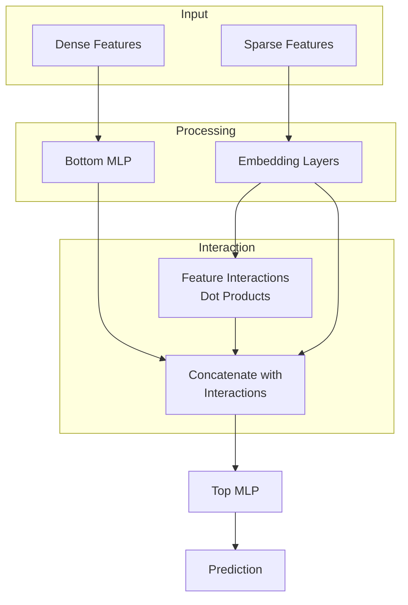

---
aliases:
  - DLRM
tags:
  - recsys
  - architecture
  - neural-network
---
Deep Learning Recommendation Model is a neural network architecture developed by Facebook to handle large-scale recommendation tasks efficiently. It focuses on combining numerical features and categorical embeddings in a computationally optimized manner. It explicitly models pairwise feature interactions using dot products, creating both first-order and higher-order feature interactions.
## Architecture
* Embedding Layers (for Sparse Features): categorical features are mapped into embeddings of the same dimension.
* Bottom MLP (for Dense Features): passes numerical features through MLP, results into representations with the same dimension as embeddings.
* Feature Interaction: takes all pairs of embedding vectors and computes dot products between them, then concatenates all of them.
* Top MLP: passes the output from the previous step into MLP and makes the final prediction with [[sigmoid]] activation function.

## Advantages
- Efficiently handles both sparse and dense features and explicitly models feature interactions unlike purely deep models
- Highly scalable for production recommendation systems

## Disadvantages
- Can have a large memory footprint due to embedding tables
- May not fully capture complex non-linear relationships between features
## Links

- [Original Paper](https://arxiv.org/abs/1906.00091)
- [Official PyTorch Implementation](https://github.com/facebookresearch/dlrm)
