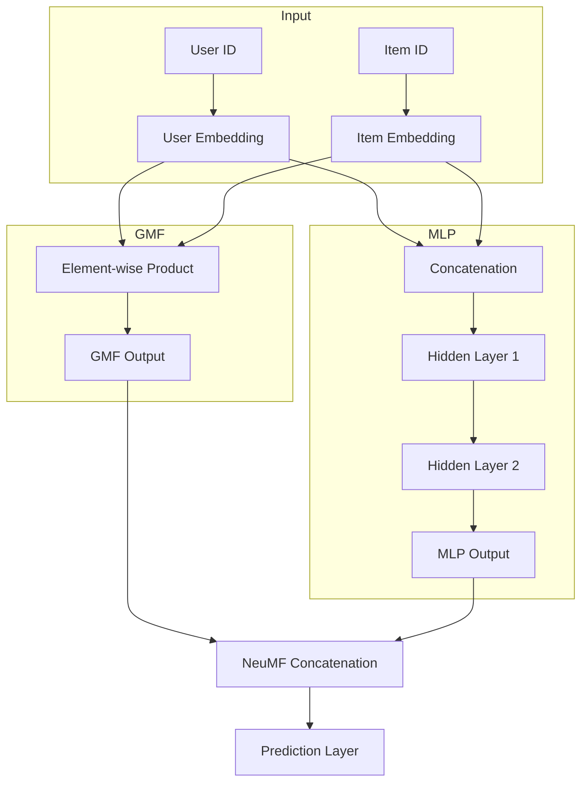

---
aliases:
  - NCF
  - Neural CF
tags:
  - algorithm
  - model
  - recsys
---
Neural Collaborative Filtering (NCF) is a deep learning approach to collaborative filtering for recommendation systems that aims to learn the complex user-item interaction function using neural networks. NCF addresses the limitations of traditional [[matrix factorization]] methods by using non-linear neural networks to model user-item interactions.

## Architecture
* Input: one-hot encoder user ID and item ID
* Embedding layer converts sparse one-hot vectors into dense user and item embeddings
* Generalized Matrix Factorization (GMF): element-wise product of user and item embeddings with sigmoid after it
* Multi-Layer Perceptron (MLP): concatenates user and item embeddings and applies multiple hidden layers with [[ReLU]] activation function with sigmoid after them
* Neural Matrix Factorization (NeuMF): concatenates the outputs of GMF and MLP, applies a projection layer and sigmoid

![[Pasted image 20250228114800.png]]
The approach uses binary cross-entropy loss for implicit feedback (interaction between the user and the item). [[Negative sampling]]: uniform sampling or popularity-based sampling strategies
### Advantages
- Captures complex non-linear interactions between users and items
- More expressive than traditional [[matrix factorization]]
- Flexible architecture that can incorporate various neural network designs
### Disadvantages
- Requires more training data and is more computationally intensive than traditional methods
- May overfit on sparse datasets
### Possible improvements
* Pre-train GMF and MLP components separately, use the pre-trained weights to initialize NeuMF
- [Neural Graph Collaborative Filtering (NGCF)](https://arxiv.org/abs/1905.08108): adds GNN and models high-order connectivity in user-item interaction graphs

## Links

- [Paper](https://arxiv.org/abs/1708.05031)
- [Official implementation](https://github.com/hexiangnan/neural_collaborative_filtering)
- [PyTorch implementation](https://github.com/guoyang9/NCF)