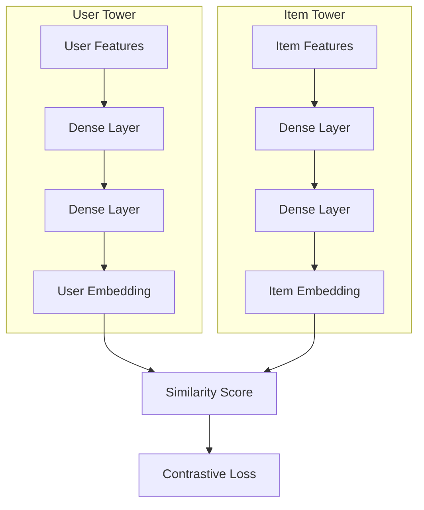

---
tags:
  - recsys
  - recommendation
  - architecture
  - approach
  - algorithm
  - embeddings
---
Two-tower architecture is a neural network approach used in recommendation systems for candidate generation and retrieval. It consists of two separate neural networks (towers) that independently encode users and items into dense embeddings in a shared vector space, where similarity between embeddings indicates relevance.

The core idea is to learn separate representations for users and items that can be efficiently compared using vector similarity (typically cosine similarity or dot product). This separation allows for pre-computation of item embeddings and efficient real-time retrieval using approximate nearest neighbor search.## Architecture and Variations

### Basic Two-Tower Architecture

Both towers typically consist of:

- **Input Layer**: Feature concatenation or embedding lookup
- **Hidden Layers**: Multiple fully connected layers with activation functions (ReLU, GELU)
- **Output Layer**: Dense embedding of fixed dimension (64-512 dimensions)
- **Normalization**: L2 normalization for cosine similarity

### Architecture Variations

* Asymmetric Towers: different architectures for user and item towers - simpler for items (focus on behavior), more complex for items (processing rich features)
* Hierarchical Towers: multi-level embeddings (category, subcategory, item)
* Attention-Enhanced Towers: self-attention within towers for sequential data or cross-attention between user history and item features (rarely used)

### Input Data and Preparation

#### User Tower Input

* Static Features: demographics and profile information
* Behavioral features: historical interactions, aggregated statistics, temporal patterns
* Sequential Features: recent interaction history, session-level interactions, time-based features (recency, seasonality)
* Contextual Features: current session context, earch queries, current browsing context

#### Item Tower Input

* Content Features: text descriptions, titles, keywords, image embeddings
* Metadata, popularity metrics, creator/source metrics

It is important to notice, that there can't be interaction features, as the towers should be independent from each other.

### Data Preprocessing

* Feature Engineering: text and image embedding extraction, embedding layers for high-cardinality features, numerical normalization for continuous features
* Sequence Processing: User History Aggregation (Average pooling, attention-weighted pooling, RNN encoding), truncation/padding (fixed-length sequences for batch processing), temporal encoding (position embeddings, time decay factors)

### Training

#### Contrastive Learning
$$\mathcal{L} = -\log \frac{\exp(\mathbf{u} \cdot \mathbf{i}^+ / \tau)}{\exp(\mathbf{u} \cdot \mathbf{i}^+ / \tau) + \sum_{j} \exp(\mathbf{u} \cdot \mathbf{i}_j^- / \tau)}$$

Where:

- $\mathbf{u}$ is the user embedding
- $\mathbf{i}^+$ is the positive item embedding
- $\mathbf{i}_j^-$ are negative item embeddings
- $\tau$ is the temperature parameter

It is possible to use Hinge-like loss: $Loss = max(0, margin - (u ⋅ v_positive) + (u ⋅ v_negative))$
Produces great embeddings, but requires a lot of computational resources.
#### Binary Cross-Entropy Loss (Pointwise)

Treat each (user, item) pair as a binary classification problem (interacted vs. not interacted). Requires explicit positive and negative labels.
$Loss = - [y * log(σ(u ⋅ v)) + (1 - y) * log(1 - σ(u ⋅ v))]$ where y=1 for positive, y=0 for negative, and σ is the sigmoid function.

#### In-batch Softmax Loss (Sampled Softmax / Listwise)
For each user (positive item) in a batch, treat all other items in that same batch (or a separate batch of negative samples) as negatives. Calculate the dot product of the user embedding with the positive item embedding and all negative item embeddings. Apply a softmax over these scores. The loss is then the negative log probability of the positive item.
$Loss = -log( exp(u ⋅ v_positive / τ) / (exp(u ⋅ v_positive / τ) + Σ exp(u ⋅ v_negative_j / τ)) )$
Very computationally efficient, but is dependent on the negative samples in the batch and requires the logQ Correction.
#### Sampling Strategies

**Positive Sampling:**

- **Explicit Feedback**: Direct interactions (clicks, purchases, likes)
- **Implicit Feedback**: Views, time spent, completion rate
- **Temporal Weighting**: Recent interactions weighted higher

**[[negative sampling]] Strategies:**

1. **Random Sampling**: Uniformly sample from all items
2. **Popularity-based Sampling**: Sample popular items more frequently
3. **Hard Negative Mining**: Sample items similar to positive items but not interacted with
4. **In-batch Sampling**: Use other items in the same batch as negatives

**In-batch Negative Sampling:** For a batch of N user-item pairs, each user's positive item serves as negatives for other users in the batch. This creates N×(N-1) negative pairs per batch.

[[logQ correction]]

### Inference and Serving

#### Two-Phase Serving

**Offline Phase:**

1. **Item Embedding Computation**: Pre-compute embeddings for all items
2. **Index Building**: Build approximate nearest neighbor (ANN) index (FAISS, Annoy, ScaNN)
3. **Caching**: Store embeddings in fast retrieval systems

**Online Phase:**

1. **User Embedding**: Compute user embedding using user tower
2. **Candidate Retrieval**: Query ANN index to find top-k similar items
3. **Post-processing**: Apply business rules, diversity filters

### Practical considerations
- Use dropout and batch normalization for regularization
- Experiment with different embedding dimensions (64, 128, 256, 512)
- Use mixed negative sampling strategies
- Apply [[logQ correction]] when using biased sampling
- Pre-compute and cache item embeddings
