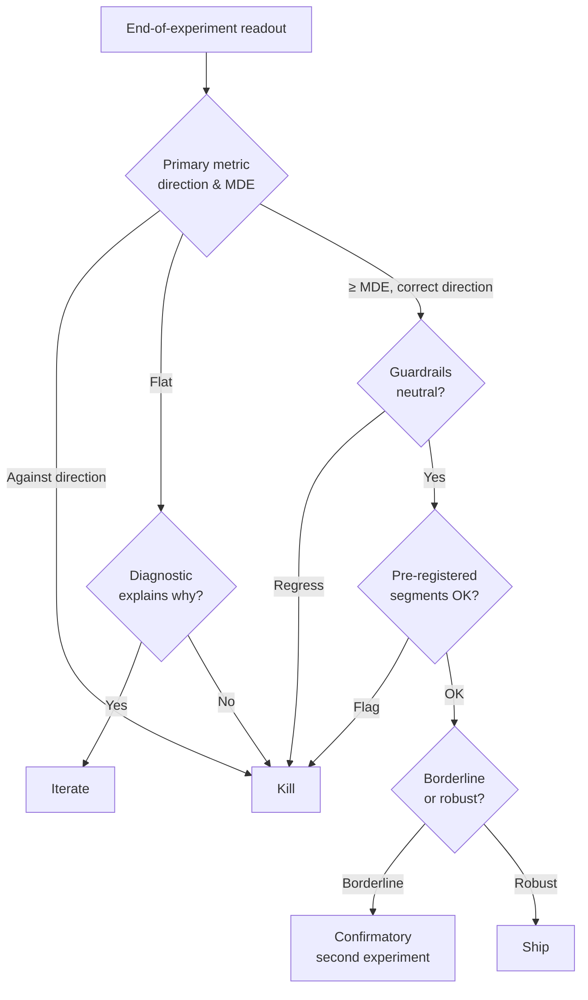

---
aliases:
  - A/B testing
  - A/B tests
  - Online controlled experiments
  - AB test
tags:
  - evaluation
  - concept
---
A/B testing (online controlled experimentation) randomly assigns units to a treatment or a control variant and compares aggregate outcomes, attributing the observed difference to the change. Randomization is what separates the causal effect of the change from confounders that would otherwise correlate with it. The rest of this note assumes familiarity with hypothesis testing, p-values, and confidence intervals.

## Experiment design

### Unit of randomization

User, session, device, request, or time slice (switchback). Finer units can improve statistical efficiency, but only if the analysis respects the independence assumption at that level. Coarser units trade efficiency for reduced interference; the unit is often chosen to contain spillovers even when that hurts efficiency.

### Metrics

Three types of metrics, defined before the experiment starts:

- Primary: the single metric the ship/kill decision is made against.
- Secondary: diagnostic metrics that help interpret the primary; not confirmatory.
- Guardrail: must-not-regress metrics (latency, error rate, policy violations) that stop the experiment regardless of the primary.

The Overall Evaluation Criterion (OEC) is an explicit combination (weighted sum, or a veto by guardrails) used when a single metric cannot capture the ship decision on its own.

Ratio metrics such as $\text{CTR} = \frac{\text{clicks}}{\text{impressions}}$ are not sample means. Variance estimation needs the delta method or bootstrap; treating them as means underestimates the variance and produces too-narrow confidence intervals. Percentile and latency metrics are similarly nonlinear; the delta method does not generalize, so bootstrap or specialized estimators are standard.

Statistical significance differs from practical significance. A small lift on a very large sample reaches significance at any reasonable $\alpha$; the MDE (the minimum detectable effect) should be set to a threshold that justifies engineering and maintenance cost, not only the smallest statistically detectable effect. Typical ways to pick the threshold: cost/benefit on engineering time, the historical distribution of prior shipped lifts (for example, the 80th percentile of wins), or an explicit business target.

### Sample size and minimum detectable effect

Sample size determines the MDE: the smallest lift the experiment has power to distinguish from zero at the chosen $\alpha$ (Type I rate) and $\beta$ (Type II rate).

For a two-sample mean comparison with equal allocation and pooled per-arm variance $\sigma^2$ (well-approximated by the control variance when effects are small):

$$n \approx \frac{2 \sigma^2 (z_{1-\alpha/2} + z_{1-\beta})^2}{\delta^2}$$

where $\delta$ is the MDE, $z_{1-\alpha/2}$ and $z_{1-\beta}$ are standard-normal quantiles, and $n$ is the per-variant sample size. At $\alpha = 0.05$ and $\beta = 0.2$ this reduces to $n \approx 16\sigma^2/\delta^2$. Rare-event metrics (tail conversions, purchases) have high relative variance and need proportionally larger samples for the same MDE.

For cluster randomization (households, geos, users with many sessions), the effective sample size is smaller than the raw count. The design effect is

$$\text{DEFF} = 1 + (\bar{m} - 1)\rho$$

where $\bar{m}$ is the average cluster size and $\rho$ is the intra-cluster correlation. Effective $n$ is $n/\text{DEFF}$. For high-correlation clusters DEFF can exceed 100, which is why geo and switchback experiments are often underpowered even when the raw sample looks adequate. When cluster sizes are skewed (New York versus Wyoming), $\bar{m}$ should be a size-weighted average: the unweighted mean understates DEFF.

Sample-size targets should also fit calendar cycles. Running experiments in full 7-day increments controls for day-of-week seasonality; stopping mid-week introduces weekday/weekend bias even when the target is already hit. Experiments spanning holidays, paydays, or product-specific seasonality can be biased by unrepresentative traffic; the standard fix is to anchor the analysis window to a representative period and exclude holiday weeks.

### Allocation

50/50 is the default. Uneven splits (for example 90/10) trade estimation precision for risk mitigation during early ramps. Stratified assignment balances a known covariate across buckets and reduces variance when the covariate correlates with the primary metric.

### Population definition

Define the analysis population before launch: all assigned units (ITT), pre-treatment eligible units, or triggered units. Common exclusions are bots, internal users and employees, opted-out cohorts, and users who never enter the trigger window. Exclusions defined independently of treatment increase power; exclusions that depend on treatment corrupt the experiment.

### Assignment and stickiness

Assignments must be random (independent of user behavior and system state), persistent (the same unit stays in the same bucket unless the design explicitly rotates), and auditable (salts, namespaces, and exclusion rules should be inspectable). Common bugs: cookie resets, cross-device duplication, logged-out traffic counted asymmetrically, filters applied after assignment, and bot or internal-user filtering that runs differently across variants.

## Statistical foundations

### Frequentist framing

The null hypothesis is usually "no effect"; the p-value is the probability of observing a statistic at least as extreme under the null. A $1-\alpha$ confidence interval covers the true effect in $1-\alpha$ of repeated experiments. One-sided tests increase power but require a pre-registered directional hypothesis.

- Type I error ($\alpha$): shipping an ineffective change.
- Type II error ($\beta$): killing an effective change.
- Power is $1 - \beta$.

### Multiple comparisons

Testing $k$ metrics independently at $\alpha = 0.05$ gives family-wise error $1 - (1-\alpha)^k$, approximately $k\alpha$ for small $k$ and small $\alpha$. Ten secondary metrics at 5% each give a 40% false-positive rate under the exact formula.

- Bonferroni: test at $\alpha/k$. Conservative; controls family-wise error under arbitrary dependence.
- Holm: step-down Bonferroni. Uniformly more powerful with the same FWER control.
- Benjamini-Hochberg: controls the false discovery rate (expected proportion of false positives among rejections). More powerful, but a different guarantee.

Pragmatic rule: use FWER control (Bonferroni, Holm) when several confirmatory primary metrics are tested together and any false positive would cause a bad ship decision; use FDR control (Benjamini-Hochberg) for secondary and exploratory metrics where hypothesis discovery matters more than individual false positives. A pre-registered single primary metric avoids multiple-testing correction for the confirmatory decision, provided the remaining metrics are treated as diagnostic rather than confirmatory.

### Bayesian framing

Report $P(\text{treatment} > \text{control} \mid \text{data})$ from the posterior under a chosen prior. Credible intervals replace confidence intervals; posterior probabilities are often reported as easier for stakeholders to interpret than p-values.

Bayesian methods are better when many small experiments share structure (hierarchical priors borrow strength across experiments), when costs are asymmetric (decision-theoretic framing weights false positives and false negatives differently), or when sample size is small enough that the prior carries real weight. With an explicitly specified model, prior, and decision rule, Bayesian monitoring can support continuous looks. Bayesian estimates do not correct interference, logging asymmetry, or biased assignment.

## Variance reduction

### CUPED

[[CUPED]] (Controlled-experiment Using Pre-Experiment Data) reduces variance by regressing the experiment metric on a pre-period covariate and analyzing the residual. Variance reduction scales with $\rho^2$, where $\rho$ is the correlation between the experiment-period metric and the pre-period covariate; Deng et al. (2013) report 30–70% on the Microsoft metrics they studied. CUPAC (Control Using Predictions As Covariates) generalizes CUPED by replacing the linear covariate with an ML model trained on pre-experiment features.

### Stratification

Balance assignment across known segments (country, platform, tenure). Reduces variance in proportion to how much the segment explains metric variation. Post-stratification (regression adjustment after the fact) is asymptotically equivalent to stratified assignment under randomization; in finite samples with imbalanced segments, pre-stratification is more robust. CUPED is itself a special case of regression adjustment on baseline covariates.

### Cluster-robust inference

When the analysis unit is finer than the randomization unit (randomize at user, analyze at session) standard errors computed under IID assumptions are wrong and Type I error is inflated. Fixes: aggregate to the randomization unit, use cluster-robust standard errors, or use block bootstrap at the cluster level.

### Outlier capping

Revenue and watch-time metrics have heavy right tails where a small fraction of users drives most of the variance. Winsorizing at the 99th or 99.9th percentile reduces variance with a small bias cost; the cap must be set on pre-experiment data and fixed across arms, since a cap chosen per bucket would reintroduce bias. Winsorization changes the estimand toward a capped-mean effect, so it should be treated as part of the metric definition rather than a harmless robustness trick.

Log transformation ($\log(1+x)$) is an alternative for heavy-tailed metrics. Comparing means of log-transformed values measures the geometric mean rather than the arithmetic mean — a different estimand that is sometimes the more defensible target but not interchangeable with the untransformed mean.

When the meaningful effect is on the tail itself (P95 session length changes while the mean does not) quantile regression or bootstrap at the quantile of interest is the tool. Variance reduction on the mean does not help if the decision-relevant movement is at the tail.

### Trigger-based analysis

Many features only affect users in a specific code path (clicked a button, saw an item, entered a flow). Restricting analysis to triggered users increases per-user effect size and removes dilution from users the change never touched. This is safe when the trigger is defined independently of treatment. When the trigger depends on treatment, counterfactual triggering (also called ghost logging or shadow logging) can recover an unbiased or substantially less biased analysis by logging the trigger condition for both arms regardless of which path was taken, provided eligibility is defined symmetrically and logged reliably. See the Triggered vs intent-to-treat failure mode below for the bias case.

## Failure modes

### Peeking and early stopping

Checking significance repeatedly and stopping at $p < 0.05$ inflates Type I error. Repeated peeks at nominal $\alpha = 0.05$ push the true false-positive rate well above 5%; the inflation grows with the number of looks and the test correlation across them ([Johari et al. 2017](https://arxiv.org/abs/1512.04922)). Mitigations: fixed-horizon analysis, alpha-spending functions, always-valid p-values (mixture Sequential Probability Ratio Test (mSPRT), confidence sequences), Bayesian stopping rules with calibrated priors.

### Novelty and primacy

- Novelty: users react to change itself; treatment effect inflates for days to weeks, then fades.
- Primacy (also called change aversion): users are slower to engage with unfamiliar interfaces; treatment looks flat or negative initially, then improves.

Plotting the treatment effect over time distinguishes a steady-state lift from a transient; major launches often run long enough to observe both phases.

### Interference and SUTVA

The Stable Unit Treatment Value Assumption requires one unit's outcome to be independent of other units' assignments. Common violations, with mechanism:

- Social-graph spillovers: treated users' behavior changes what untreated friends see and do.
- Shared-inventory marketplaces: treated users' actions consume supply or raise prices that control users also face.
- Production-system effects: treatment fills caches that control then hits; treatment exposure retrains a global model that scores control users; treatment events feed bandits that allocate across arms.

Mitigations:

- Cluster randomization: randomize at the level where interference ends (household, team, region).
- Switchback experiments: alternate treatment and control over time on the full population.
- Geo-based experiments: assign by geography when the service is region-segmented.
- Bipartite randomization: in two-sided marketplaces, randomize both sides independently and analyze the interaction term to quantify spillover directly.
- Network designs such as ego-cluster (assign densely connected user clusters together) or exposure-mapping (model dose from treated peers) for social experiments.

### Triggered vs intent-to-treat

Intent-to-treat (ITT) measures the effect on everyone assigned to treatment, whether or not they encountered the change. Triggered analysis restricts to units that actually encountered it. Triggered analysis is safe when the trigger is defined independently of treatment (pre-treatment eligibility). When treatment changes who enters the trigger window (post-treatment exposure), triggered analysis is biased; ITT is the conservative default.

### Sample ratio mismatch

SRM means the observed assignment counts differ from expected counts more than random chance explains (for example, a 50/50 experiment producing a 49.2/50.8 split at high traffic). The cause is upstream of analysis: an assignment bug, a logging bug, or an exclusion filter that differs across variants. A chi-squared test on the bucket counts is the standard check. A strong SRM means the randomization or logging path is broken enough that interpretation is unsafe; $p < 0.001$ is a common alarm threshold, though the exact cutoff is policy. Debug by slicing the chi-squared test iteratively by browser/app version, platform, country, day-of-week, or traffic source until the affected segment is isolated.

Balanced bucket counts do not guarantee balanced underlying populations. Pre-treatment covariate balance checks (country, device, tenure, historical activity) are the same logic applied one level deeper: any bucket-level imbalance on pre-period variables signals an assignment or filtering problem that SRM may have missed.

### Logging asymmetry and denominator drift

Treatment logs an event that control does not, or vice versa, and every downstream metric becomes incomparable. The same failure shows up on ratio denominators: treatment can change the number of impressions, the opportunity count, or the render-success rate, which makes CTR or conversion-per-session move for denominator reasons rather than genuine relevance changes. A/A tests before launch catch logging-symmetry bugs. SRM checks catch many bucket-imbalance bugs. Denominator drift is caught by logging opportunity counts as a separate metric and checking comparability before interpreting the ratio.

Simpson's paradox is a related but distinct mode: aggregate CTR can move in the opposite direction of every segment's CTR when the treatment changes the segment mix. Reporting key metrics per segment alongside the aggregate catches this.

### Missing data and delayed outcomes

Purchases, subscriptions, churn, and retention often have delayed or censored labels. Reading results before labels mature biases estimates toward short-term behavior. Fix attribution windows before launch, align experiment duration with label maturation, and compare early vs matured estimates on the same cohort to detect the bias.

### Cannibalization

A change can lift a local metric (clicks on a new widget) while leaving the global metric flat because the new engagement came from other surfaces rather than being incremental. Total-session, total-revenue, and cross-surface guardrails catch it. In e-commerce and recommender systems, a +10% lift on the new module with flat session revenue is a warning sign for click shifting, even though it isn't a diagnosis. Flat global metrics can also be due to insufficient duration, measurement noise, or delayed downstream outcomes, so cannibalization should be confirmed with cross-surface metrics before it becomes the ship decision.

### Heterogeneous treatment effects

The average treatment effect can hide opposing effects across segments. Pre-registered segment analyses are valid for the confirmatory decision; post-hoc "slice until a segment is significant" is p-hacking under a different name. Drill-down for understanding why a change works is legitimate and often necessary, and it is distinct from drill-down for go/no-go: slicing to explain a mechanism informs the next iteration but is not the basis for shipping to the newly-found segment. Causal forests and uplift models estimate the Conditional Average Treatment Effect (CATE) without per-segment multiple-comparisons correction, but need enough data per segment.

### Winner's curse and regression to the mean

Among experiments that reach significance, observed effect sizes are biased upward: the winners are the ones whose noise pushed them past the threshold. Replication lifts are smaller than initial lifts on average. Shrinkage toward a prior mean or a confirmatory second experiment are the standard mitigations when deciding on a borderline win.

### Long-term vs short-term effects

A two-week experiment captures two weeks of behavior. Long-term holdouts (a small population that remains on control indefinitely) measure effects that compound or decay over months. Holdouts are used selectively for major launches where long-term impact is uncertain, because they are expensive to maintain. A global holdback (a cohort held out of all features shipped in a quarter) measures cumulative impact, which is typically smaller than the sum of individual A/B lifts (see Cannibalization above).

### Ecosystem effects

User-facing metrics can improve while the ecosystem the product depends on degrades: creator exposure concentrates, supply diversity drops, marketplace liquidity falls. Ecosystem metrics (Gini coefficient on creator impressions, new-creator engagement, category coverage) are guardrails for two-sided platforms.

### Interactions between simultaneous experiments

When many experiments run in parallel, treatment effects can interact. Two changes that each move a metric +1% can produce 0% combined, or +3%. Mitigations: orthogonal assignment layers that reduce unwanted overlap patterns and simplify interpretation, though they do not eliminate true product interactions; domain-restricted exclusivity for high-risk experiments; scheduled interaction monitoring on shared primary metrics.

### A/A tests

Run treatment equal to control as a platform sanity check. Over many A/A tests, p-values should be uniform on $[0, 1]$ and the observed false-positive rate at $\alpha = 0.05$ should be 5%. Deviation indicates a broken variance estimator, biased assignment, or correlated units being treated as independent.

## Alternatives and extensions

### Multi-armed bandits

[[Multi-armed bandits]] adapt traffic allocation toward better-performing arms as evidence accumulates (Thompson sampling, Upper Confidence Bound (UCB), epsilon-greedy). The choice between bandits and A/B tests is about what the experiment optimizes: bandits minimize cumulative regret during learning; A/B tests maximize estimation precision for a specific contrast at the end. Use bandits when ongoing exploration is part of the product mechanism; use A/B when the goal is a clean ship/kill decision with a precise effect estimate. See [[Cold start]] for bandits in cold-start scenarios.

### Sequential testing

mSPRT, group-sequential designs, and confidence sequences allow continuous monitoring without alpha inflation. These are useful when waiting for the fixed horizon is expensive or risky. When the upper bound of the confidence interval after a partial sample is already below the MDE, continuing wastes the slot.

### Switchback experiments

Alternate treatment and control over time on the entire population. Standard in marketplaces (pricing, dispatch, matching) where user-level randomization violates SUTVA. Block length must exceed the time for treatment effects to stabilize; otherwise carryover between blocks contaminates the estimate. A washout period (discarding the first several minutes of data at the start of each block) removes the carryover residue.

![[switchback_timeline.svg]]

### Interleaving

For ranking comparisons, interleave results from treatment and control rankers in the same response and attribute clicks to the originating ranker. Team-Draft Interleaving (TDI) is the canonical variant. [Chapelle et al. (2012)](https://dl.acm.org/doi/10.1145/2094072.2094078) and subsequent studies at Yandex and Microsoft report interleaving as typically 10–100× more sensitive than user-level A/B for ranking-specific comparisons, with the factor varying by surface. Applies only where interleaving is presentable (search, recommendations in list form).

### Quasi-experiments

When randomization is not possible (regulatory rollout, staged launch, historical analysis):

- Difference-in-differences: compare the change in outcomes for a treated group versus a comparable untreated group across two periods, under the parallel-trends assumption.
- Synthetic control: construct a weighted combination of untreated units that matches the treated unit's pre-period trajectory; the post-period gap estimates the treatment effect.
- Regression discontinuity: when treatment is assigned by a sharp cutoff on a continuous variable, units just above and just below the cutoff are quasi-randomized.

Each identifies a counterfactual under assumptions that must be defended. See [[Counterfactual evaluation]] for offline alternatives based on logged data.

## Operational practice

### Pre-registration

Commit to the primary metric, key segments, analysis window, and decision rule before seeing data.

### Experiment platform

Standard capabilities:

- Audit trail: who ran what, when, with which filter.
- Automatic SRM checks on every running experiment, plus periodic A/A validation at the platform level.
- Orthogonal assignment layers so overlapping experiments do not produce correlated pairs.
- Versioned metric definitions. Metric logic, attribution rules, bot filters, and late-event handling should be frozen for the experiment duration; changing them mid-run silently breaks comparability.
- Standard variance estimators per metric type (delta method for ratios, bootstrap for percentiles).

### Ramp-up

1% → 5% → 25% → 50% is typical. Early ramps catch integration bugs and SRM. Later ramps provide statistical power. Guardrails trip the experiment back one ramp rather than all the way off, unless the regression is severe.

### Decision framework

Ship when the primary metric moves in the pre-registered direction by at least the MDE, guardrails are neutral, and pre-registered segments do not flag. Iterate when the primary is flat but a diagnostic metric explains why. Kill when guardrails regress or the primary moves against the direction. Borderline wins go to a confirmatory second experiment before any ship decision.

When the primary, a key diagnostic, and a guardrail point in different directions, the ship decision becomes a judgment call. The decision should come from product side.

## Applications

### Recommendation and ranking

See [[Recommendation system]] for the full pitfall list. Ranking-specific additions: interleaving instead of user-level A/B, ecosystem metrics for two-sided platforms, candidate-source diagnostics when a ranker A/B produces a flat or negative primary.

### Model launches

Shadow traffic → canary → A/B → ramp. Offline evaluation on a [[Validation]] set estimates expected effect size; A/B confirms it online. The full flow is a common [[ML System design]].

### Marketplaces and pricing

Unit-level randomization fails when supply or price interacts across the population. Switchback (temporal) and geo-based (spatial) randomization are the standard tools. Spillover shrinks the observed lift relative to the true effect.

## Common mistakes

Practitioner actions to watch for, distinct from the failure modes above:

- Slicing post-hoc until a segment reaches significance and shipping to that segment.
- Shipping with a borderline primary metric with a red guardrail because the lift looks large.
- Extrapolating a two-week lift to annual impact by multiplying by 26.
- Treating a non-significant result in an underpowered experiment as evidence of zero effect.
- Choosing the OEC after inspecting the data.
- Re-defining the primary metric mid-experiment.
- Treating sessions as independent when randomization was at the user.
- Confusing statistical significance with practical significance at scale.
- Changing metric logic, attribution, or bot filtering mid-experiment.

## Links

- Kohavi, Tang, Xu — *Trustworthy Online Controlled Experiments* (Cambridge University Press, 2020).
- [Microsoft ExP Platform publications](https://exp-platform.com/).
- [Deng, Xu, Kohavi, Walker — CUPED (2013)](https://www.exp-platform.com/Documents/2013-02-CUPED-ImprovingSensitivityOfControlledExperiments.pdf).
- [Johari, Koomen, Pekelis, Walsh — Always Valid Inference (2017)](https://arxiv.org/abs/1512.04922).
- [Tang, Agarwal, O'Brien, Meyer — Overlapping Experiment Infrastructure (Google, 2010)](https://research.google/pubs/overlapping-experiment-infrastructure-more-better-faster-experimentation/).
- [Chapelle, Joachims, Radlinski, Yue — *Large-scale validation and analysis of interleaved search evaluation* (ACM TOIS, 2012)](https://dl.acm.org/doi/10.1145/2094072.2094078).
- [X5 Tech — A/B-тесты в ритейле](https://habr.com/ru/companies/X5Tech/articles/846298/).
