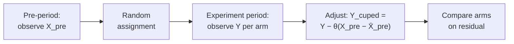

---
aliases:
  - Controlled-experiment Using Pre-Experiment Data
  - CUPAC
tags:
  - evaluation
  - concept
---
CUPED makes A/B tests detect smaller effects without needing more users. Each user's experiment-period metric is partly predictable from their pre-experiment behavior; subtracting that predictable part leaves a smaller residual, and a smaller residual variance means a smaller MDE (minimum detectable effect).

CUPED (Controlled-experiment Using Pre-Experiment Data) reduces variance in randomized online experiments by regressing out variation explained by pre-experiment user behavior. The underlying technique is control-variate adjustment applied to A/B tests; see [[AB Tests]] for the parent topic.

## Formula

CUPED regresses the experiment-period metric on a pre-period covariate and analyzes the residual:

$$Y_{\text{cuped}} = Y - \theta (X_{\text{pre}} - \bar{X}_{\text{pre}})$$

where:

- $Y$ is the experiment-period metric.
- $X_{\text{pre}}$ is a covariate measured pre-assignment (typically the same metric, or a correlated one, measured during a pre-experiment window).
- $\bar{X}_{\text{pre}}$ is the pooled mean of $X_{\text{pre}}$ across arms.
- $\theta = \text{Cov}(Y, X_{\text{pre}}) / \text{Var}(X_{\text{pre}})$ is the optimal control-variate coefficient.

$Y_{\text{cuped}}$ is unbiased for the average treatment effect because treatment is randomized and $X_{\text{pre}}$ is measured before assignment.

## Variance reduction

Variance of the adjusted estimator scales with $\rho^2$, where $\rho$ is the correlation between $Y$ and $X_{\text{pre}}$:

$$\text{Var}(Y_{\text{cuped}}) = \text{Var}(Y)(1 - \rho^2)$$

So $\rho = 0.3$ yields 9% variance reduction; $\rho = 0.7$ yields 51%; $\rho = 0.9$ yields 81%.

![[cuped_variance_reduction.svg]]

Deng et al. (2013) report 30–70% variance reduction on the Microsoft metrics they studied (sessions, revenue), corresponding to $\rho$ roughly 0.55 to 0.84. Realized reduction on other metrics depends on the specific autocorrelation structure.

## Choosing the covariate

The standard covariate is the same metric measured pre-period. Alternatives:

- A related metric with higher autocorrelation.
- A sum of multiple pre-period signals.
- A model prediction of $Y$ trained on pre-experiment features (see CUPAC below).

The covariate must be measurable before treatment assignment. A pre-assignment covariate is independent of treatment by construction, which preserves unbiasedness of the estimator.

## CUPAC

CUPAC (Control Using Predictions As Covariates) generalizes CUPED by replacing the linear covariate with an ML model trained on pre-experiment features:

$$Y_{\text{cupac}} = Y - \theta (\hat{Y} - \bar{\hat{Y}})$$

where $\hat{Y}$ is the model prediction of the experiment-period outcome from pre-experiment features only. Variance reduction still scales with $\rho^2$, now measuring the correlation between $Y$ and $\hat{Y}$.

The gain over CUPED scales with how much better the ML model predicts $Y$ than a single linear covariate does. The predictor must use only pre-treatment information; leakage risk is higher than with CUPED because a flexible model can accidentally ingest post-assignment signal if feature pipelines are not audited.

## Relationship to stratification

CUPED is a special case of regression adjustment on baseline covariates. Stratified assignment balances a covariate across buckets at assignment time; post-stratification regresses on the covariate after the fact. CUPED is post-stratification with a continuous covariate and an optimal weighting.

Under randomization, post-stratification is asymptotically equivalent to pre-stratification; in finite samples with imbalanced segments, pre-stratification is more reliable because it forces balance rather than estimating it.

## When CUPED underperforms

- New users with no pre-period behavior: the covariate is undefined or zero, so the regression has no traction.
- Metrics driven by novelty or one-off events: correlation with past behavior is weak.
- Rare-event metrics: the pre-period base rate is too low to produce a usable covariate.
- Metrics with a different population in the experiment window than in the pre-period (seasonal onboarding, region launches).

## Common pitfalls

- Including post-assignment features in $X_{\text{pre}}$. Breaks unbiasedness; inflates reported variance reduction while corrupting the average treatment effect (ATE) estimate.
- Computing $\theta$ per-bucket instead of pooled. The covariate mean $\bar{X}_{\text{pre}}$ must be pooled across arms.
- Treating CUPED as a universal variance halver. The gain is entirely driven by $\rho^2$; at $\rho = 0.3$ the variance reduction is only 9%.
- Confusing CUPED with counterfactual variance reduction on observational data. CUPED works because randomization guarantees the covariate is independent of treatment; applying the same math to non-randomized data does not produce the same guarantees.

## Links

- [Deng, Xu, Kohavi, Walker — CUPED (2013)](https://www.exp-platform.com/Documents/2013-02-CUPED-ImprovingSensitivityOfControlledExperiments.pdf). The original paper.
- Kohavi, Tang, Xu — *Trustworthy Online Controlled Experiments* (Cambridge University Press, 2020). Chapter on variance reduction covers CUPED and CUPAC with implementation guidance.
