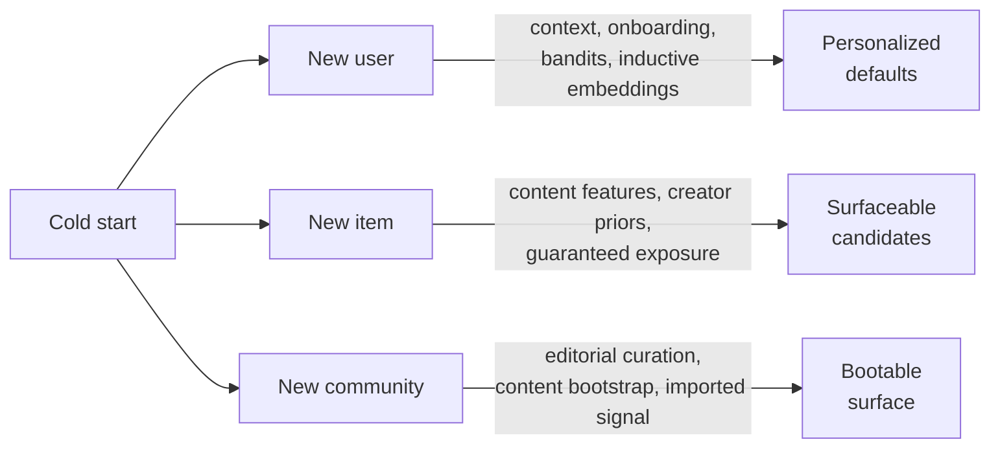

---
aliases:
  - Cold-start problem
  - Cold-start
tags:
  - recsys
  - concept
---
Cold start is the problem of producing useful recommendations when a user, item, or market has little or no reliable interaction history. This includes both true zero-history entities and sparse-history ones whose observed behavior is not yet enough to trust a recommendation model. The new-item formalization and its recommendation-quality metrics trace to [Schein, Popescul, Ungar, Pennock (SIGIR 2002)](https://doi.org/10.1145/564376.564421). The same structural issue (no historical signal for a fresh entity) occurs in ranking, classification, and online experimentation whenever a new entity enters a pipeline trained on logged behavior.

Three commonly distinguished cases:

- New user: no past interactions to personalize against.
- New item: no clicks or ratings to learn collaborative signal from.
- New community: the company is new, so it has neither user nor item history.

Cold start is distinct from exploration-exploitation. Cold start is the absence of a signal for a specific entity; exploration is the policy choice of how to balance learning against utility. They connect through one mechanism: the cold phase is when a bandit's exploration term is largest, because posterior variance is highest for unseen entities.

## New user cold start

Approaches, roughly from least to most personalized:

- Popularity-based defaults: serve the global top items, optionally stratified by basic signals (country, language, device, age band). Catches the wide head of preference; loses precision once taste-specific personalization matters. The popularity prior is also the natural starting point for bandit policies.
- Context-based personalization: features available at the first request (referrer, time, location, device, query, signup form fields). Some platforms persist a shadow profile tied to device ID, cookie, or fingerprint that accumulates signal across pre-signup visits and merges into the registered user on signup. Both are subject to privacy-policy constraints.
- Cross-surface signal import: a user cold on one surface (video) is often warm on another surface of the same platform (search, social, marketplace). A shared user embedding or cross-surface behavioral features transfer signal across the boundary.  Behavior on one surface may misrepresent intent on another.
- Demographic clustering: assign the new user to the nearest cluster of existing users (by signup attributes or context) and recommend the cluster's top items. Useful when registration data exists but is sparse.
- Asking users questions during onboarding: to rate or pick items, genres, or topics at signup, common in music and video streaming. Longer signup increases drop-off, and ratings on a small set generalize unevenly. Active-learning can target the items that maximize information per rating.
- LLM-inferred preferences: free-text onboarding ("I like hard sci-fi and strategy games") mapped by an LLM to taxonomy nodes or extract embeddings. Turns unstructured signup input into a usable cold profile without a long rating flow.
- Sequential session models: a new user with no cross-session history still produces signal within their first session (items viewed, dwell time, scroll depth, skips). Sequential models in the SASRec or BERT4Rec family produce a usable in-session representation from those events. Distinct from context-based personalization (which uses request metadata) and from onboarding (which uses explicit elicitation); the signal here is implicit in-session behavior.
- Bandits over candidate policies: a [[Multi-armed bandits|bandit]] policy treats candidate items, segments, or recommendation strategies as arms; the per-user posterior updates as the user interacts. Contextual variants such as [LinUCB](https://arxiv.org/abs/1003.0146) and neural contextual bandits condition arm choice on observed context, intended to shorten the cold phase.
- Inductive embedding models: a model that maps context features to a user embedding (instead of looking up a per-user embedding) produces a usable representation for an unseen user. The general technique is ID dropout: randomly mask the ID token to OOV during training, forcing the model to backpropagate through the content/feature branch. [DropoutNet](https://papers.nips.cc/paper_files/paper/2017/hash/dbd22ba3bd0df8f385bdac3e9f8be207-Abstract.html) has two-branches: a collaborative/preference representation and a content representation, with dropout applied to the collaborative branch so the model produces good embeddings from content alone when preferences are missing. [MeLU](https://arxiv.org/abs/1908.00413) uses MAML-style meta-learning for fast adaptation from a few ratings.

## New item cold start

The new item has no clicks, ratings, or other collaborative signals. Approaches:

- Content-only retrieval: encode the item from its content (text description, image, tags, taxonomy) and make it retrievable for users whose profile or recent-session embedding is close to the item's content embedding. The classic [[Content-Based Filtering|content-based filtering]] route, often run as a separate candidate source alongside [[Collaborative Filtering|collaborative filtering]].
- Item-content towers in two-tower models: a [[Two-tower]] retriever whose item tower consumes content features generalizes to unseen items at serving time. 
- ID-embedding initialization from content: in a model with learned per-item ID embeddings, a new item's ID embedding is random until it accumulates gradient. Initialize it from the item's content embedding, the centroid of similar items' ID embeddings, or a hierarchical fallback (brand or category embedding when the item ID is OOV).
- Relational propagation: propagate signal through a knowledge or co-occurrence graph (a new film by a known director inherits the director's audience; a new SKU inherits its brand-category neighborhood). Inductive graph models such as GraphSAGE and PinSAGE compute a new node's embedding on the fly from its neighbors' embeddings, with no retraining. Distinct from content embeddings (relational rather than descriptive) and from creator priors (graph-structured rather than a single scalar).
- Creator or seller priors: when item features are weak, prior behavior of the creator, seller, or publisher (channel CTR, seller conversion rate, prior content engagement) often predicts new-item performance.
- LLM-bootstrapped signal: LLM-derived item embeddings from text or metadata, and LLM-generated synthetic interactions, give a non-trivial prior for items whose hand-crafted content features are not enough. Treat synthetic interactions as priors or pretraining data, otherwise the model fits the LLM's preferences rather than the user population's.
- Guaranteed-exposure budget: allocate a fixed slice of impressions to new items regardless of model score, so the system builds collaborative signal it would otherwise never collect. Variants include per-creator quotas, age-decayed boosts, and new-campaign bid boosts or reserved-fraction explore budgets in ad auctions. Without an exposure guarantee, candidate retrieval often freezes around items the warmup phase already surfaced.
- Exploration-efficient allocation: where the explore budget is spent matters as much as how large it is. Thompson sampling over new items, and targeting exposure at users whose feedback is most informative (high-activity, diverse-taste users), build collaborative signal faster than uniform random exposure for the same budget. Log propensities, slot, candidate source, and eligibility rules for every exploratory impression; without those, later evaluation cannot separate item quality from exposure policy.
- Canary exposure on a warm subset: serve the new item to a small randomized subset of warm users while excluding it from the primary surface, then collect labels before broader promotion. Distinct from pure shadow scoring (computing features and scores without exposure), which catches pipeline bugs but collects no user-response labels; only real exposure produces labels.

## Warm-up transition

Cold start approaches need a mechanism to switch to normal models after enough data is collected. Common approaches:

- Count-based interpolation: blend the cold prior and the warm score with a weight that decays as interactions accumulate. A common form is $\alpha = \frac{n}{n + k}$ where $n$ is the interaction count and $k$ a tunable prior strength; the served score is $(1-\alpha) \cdot \text{cold} + \alpha \cdot \text{warm}$.
- Bayesian shrinkage: treat the cold prior as a prior distribution over the user or item embedding and shrink the learned embedding toward it, with the shrinkage decaying as posterior variance falls.
- Embedding warm-up: initialize the learned ID embedding from the content embedding (or the centroid of similar items' embeddings) so the representation is continuous through the transition rather than jumping from random to learned.
- Confidence-gated routing: route to the cold path while a confidence estimate (interaction count, posterior variance, calibrated prediction uncertainty) is below threshold, blending across the boundary instead of switching at it.

Cold and warm scores must be calibrated or normalized onto a common scale before blending; otherwise the larger-scale score dominates regardless of the intended confidence weight.

## New company

A recommender starting from scratch has neither user nor item history. The early phase relies on whatever non-interaction signal exists: editorial curation, content embeddings, demographic priors, signal imported from an external graph or a related product, and aggressive exploration. Imported signal must be legally usable, privacy-safe, and distributionally relevant to the new population; otherwise it results in a misleading prior. In marketplaces this is the two-sided bootstrapping problem (buyers attract sellers and sellers attract buyers, with neither present at launch); standard fixes are subsidizing one side, manually seeding supply, and geographic rollout to reach liquidity locally before expanding. As enough interactions accumulate, the system can begin warm-side training while content-based retrieval continues to serve tail items. Shadow logging and bandit infrastructure introduced during this phase remain available for later cold-start work.

## Evaluation

Aggregate offline metrics computed on the full population (such as [[NDCG]] or recall@k) mask cold-start performance, because the cold subpopulation is small relative to the warm user base. Some possible appraaches:

- Held-out cold splits: hold users or items out of training so the model never sees their collaborative history, then evaluate on their held-out future interactions.
- Few-shot performance curves: report the primary metric as a function of available history ($0$, $1$, $3$, $5$, $10$, $50$ interactions). A working cold-start system should improve as data accumulates, not work only at exactly zero or fully warm.
- Decompose time-to-first-interaction into three operationally distinct stages: time to first eligible retrieval (was the item retrievable at all?), time to first impression (did the system surface it?), and time to first positive interaction (did users engage?).
- New-item coverage: the fraction of newly added items that received at least one impression within a defined window.
## Common pitfalls

- Confusing freshness, coldness, retrieval coverage, and feature lag. An item live for a week with zero impressions might be cold for any of several reasons: poor retrieval coverage (fix: retrieval), filtered out by serving policy (fix: policy), unindexed because the ANN index refreshes too slowly (fix: index freshness, a [[Training-serving skew]]-class infrastructure problem), missing exposure budget (fix: explore budget), or warm in behavior but feature-cold because the pipeline has not backfilled features yet (fix: a fast-path that synchronously computes cheap features and async-backfills the expensive ones).
- Treating cold start as a permanent label: once interactions accumulate, the same user or item should move to a normal model.
- Exposure budgets without a quality gate: guaranteed exposure for new items is also exposure to bad new items. Combine with a content-quality classifier (spam, low-effort, policy violations) to avoid serving low-value content uniformly.
- Gaming the new-item boost: on marketplaces, ads, social feeds, and content platforms, creators or sellers can churn out low-quality "new" items to capture exploration exposure. Quality gates, per-creator rate limits, and abuse monitoring are needed alongside the budget itself.
- Position bias confounding cold-start measurement: new items placed in lower slots show worse CTR than warm items in top slots even when underlying quality is the same. Either compare within fixed slots or use position-debiased estimators.

## Limitations

- Content-only retrieval has a quality ceiling: items with weak or generic content features get a flat embedding that does not discriminate well. Movies and books often carry semantically rich descriptions; many e-commerce SKUs have templated, duplicated, or thin metadata, so content embeddings collapse unless enriched with taxonomy, image, brand, and relational features.
- Cold-start mitigation trades off against [[Bias and feedback loops]]: aggressive exploration hurts short-term metrics, while the absence of exploration tends to collapse new-item coverage over time.
- Meta-learning approaches (MeLU and successors) require an episodic training distribution that mimics few-shot adaptation. Without it, offline evaluation overstates online performance and the model is no better than a warm-trained two-tower with content features.
- The cold-segment population is small by definition. Most cold-start A/B tests are under-powered unless designed with the cold split as the primary unit of analysis from the start.

## Links

- [Schein, Popescul, Ungar, Pennock — Methods and Metrics for Cold-Start Recommendations (SIGIR 2002)](https://doi.org/10.1145/564376.564421)
- [Li, Chu, Langford, Schapire — A Contextual-Bandit Approach to Personalized News Article Recommendation (WWW 2010)](https://arxiv.org/abs/1003.0146)
- [Volkovs, Yu, Poutanen — DropoutNet: Addressing Cold Start in Recommender Systems (NeurIPS 2017)](https://papers.nips.cc/paper_files/paper/2017/hash/dbd22ba3bd0df8f385bdac3e9f8be207-Abstract.html)
- [Lee, Im, Jang, Cho, Chung — MeLU: Meta-Learned User Preference Estimator for Cold-Start Recommendation (KDD 2019)](https://arxiv.org/abs/1908.00413)
- [Zhang et al. — Cold-Start Recommendation towards the Era of Large Language Models: A Comprehensive Survey and Roadmap (2025)](https://arxiv.org/abs/2501.01945)
- [Cold start (recommender systems) — Wikipedia](https://en.wikipedia.org/wiki/Cold_start_(recommender_systems))
