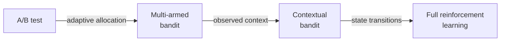

---
aliases:
  - Bandits
  - Bandit algorithms
  - Thompson sampling
  - UCB
  - Contextual bandits
tags:
  - algorithm
  - concept
---
A multi-armed bandit is a sequential decision problem where a learner repeatedly chooses among $k$ actions (arms), observes a stochastic reward for the chosen arm only, and adapts future choices to balance exploration (sampling under-tested arms to learn their value) against exploitation (sampling the arm currently believed best).

## Problem formulation

At each round $t$, the learner selects arm $a_t \in \{1, \ldots, k\}$ and observes reward $r_t \sim \mathcal{D}_{a_t}$ where $\mathcal{D}_{a_t}$ is the unknown reward distribution of arm $a_t$. The learner's goal is to minimize cumulative regret: the gap between the reward an oracle who always pulled the best arm would have collected and the reward the learner actually collected. Regret is the cost of not knowing the best arm in advance and accumulates on every round the learner picks suboptimally:

$$\text{Regret}(T) = T \cdot \mu^* - \sum_{t=1}^{T} \mathbb{E}[r_t]$$

where $\mu^*$ is the mean reward of the best arm and $T$ is the time horizon. A good policy achieves $\text{Regret}(T) = O(\log T)$ (logarithmic regret) or $O(\sqrt{T})$ depending on the problem structure.

Logarithmic regret means cumulative regret grows like $\log T$ rather than linearly with $T$, so the per-round regret eventually shrinks toward zero as the learner identifies the best arm. UCB and Thompson sampling achieve logarithmic regret on stochastic bandits with a unique best arm; epsilon-greedy with constant $\epsilon$ never stops random exploration and accumulates linear regret $O(T)$.

## Core algorithms

- Epsilon-greedy: pick the best-known arm with probability $1 - \epsilon$, pick a random arm with probability $\epsilon$. Simple; $\epsilon$ can decay over time. Linear regret in expectation unless $\epsilon$ decays to zero.
- UCB (Upper Confidence Bound): pick the arm maximizing $\hat{\mu}_a + \sqrt{2 \log t / n_a}$, where $\hat{\mu}_a$ is the empirical mean reward and $n_a$ is the number of pulls of arm $a$. Deterministic, logarithmic regret, one confidence-constant hyperparameter.
- Thompson sampling: maintain a Bayesian posterior over each arm's reward distribution, draw a sample from each posterior, pick the arm with the highest sample. Logarithmic regret, competitive with or better than UCB empirically under model mismatch.

All three scale to $k$ in the hundreds; contextual variants extend to larger action spaces by sharing information across arms with similar context.

## Contextual bandits

When a context $x_t$ is observed before each action (user features, query, time-of-day), the learner targets the optimal action given context rather than the single best arm. The reward model becomes $\mu_a(x)$, parameterized by a linear or neural function.

Common variants:

- LinUCB: linear reward model with a UCB-style exploration bonus based on covariance of the parameter estimate.
- Contextual Thompson sampling: posterior over the parameter vector, sample and choose the best action under the sample.
- Neural bandits: deep model for $\mu_a(x)$ with exploration via dropout, ensembles, or bootstrap.

Contextual bandits extend pure bandits to personalized decisions by conditioning arm choice on the observed context.

## Regret vs estimation

Bandits and A/B tests optimize different objectives:

- Bandits minimize cumulative regret during learning: the loss from not picking the best arm on each round.
- A/B tests minimize estimation variance on a specific contrast: the uncertainty about which arm is best after a fixed sample.

The choice depends on what the experiment is for. Use bandits when every round's choice matters (live traffic, real cost of exploration) or when ongoing exploration is part of the product mechanism. Use A/B when a clean ship/kill decision matters more than regret during the decision period.

![[mab_allocation_over_time.svg]]

## Applications

- Cold start in recommendation systems: bandits assign new users or items to candidate policies while building confidence. See [[Cold start]].
- Ad auction allocation: adaptive bid allocation across creatives or bid strategies.
- Headline and landing-page optimization on content or commerce pages.
- Clinical trial allocation with adaptive randomization.
- Online learning as a simplified reinforcement-learning setting with no state transitions.

## Relationship to reinforcement learning

A multi-armed bandit is a reinforcement learning problem with a single state: actions exist, rewards are stochastic, but the environment does not transition between states. Every round is independent of the previous one. Bandits are the simplest RL setting and a common testbed for exploration algorithms.

## Common pitfalls

- Delayed rewards break naive bandit algorithms. Attribution windows must be modeled explicitly, or credit lands on the wrong arm.
- Non-stationary reward distributions invalidate the regret bounds. Sliding-window or discounted-reward variants handle drift.
- Correlated arms (shared features, similar content) mean independent bandits waste data. Contextual bandits share statistical strength across arms with similar context.
- Bandits are not a substitute for a well-designed A/B test when the goal is a confirmed causal effect estimate for a specific contrast.

## Links
- Sutton & Barto — *Reinforcement Learning: An Introduction* (2nd ed., 2018). Chapter 2 covers bandits in the RL context.
- Lattimore & Szepesvári — *Bandit Algorithms* (Cambridge University Press, 2020). Comprehensive modern treatment of bandits, regret theory, and contextual variants.
- [Chapelle & Li — An Empirical Evaluation of Thompson Sampling (2011)](https://papers.nips.cc/paper/2011/hash/e53a0a2978c28872a4505bdb51db06dc-Abstract.html). Canonical empirical comparison of Thompson sampling against UCB.
