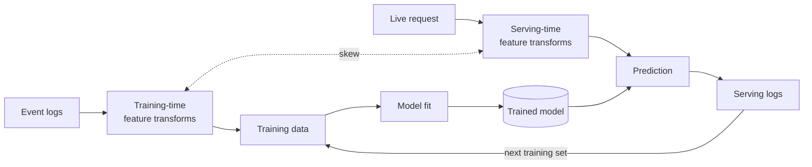

---
aliases:
  - Train-serve skew
  - Training-serving mismatch
  - Online-offline skew
tags:
  - evaluation
  - concept
---
Training-serving skew is a mismatch between the data representation used to train and evaluate a model and the representation available at serving time. A common symptom is offline metrics improving while online metrics regress or stall: the model is trained on a distribution it will not see in production, and offline metrics computed on that distribution overstate online performance. Skew is one of the data-dependency risks cataloged in [Sculley et al. (2015)](https://papers.nips.cc/paper/5656-hidden-technical-debt-in-machine-learning-systems) on system-level technical debt in ML systems.

The dashed edge marks where the two pipelines can diverge (different code paths, different freshness, different schema versions), even when both feed the same model. Either side can drift independently. Logging served features for retraining — the feedback edge from serving logs back to training data — is the strongest structural defense.

## Skew, distribution shift, and concept drift

These three failure modes share the same offline-up / online-flat symptom but have different causes and fixes.
- Skew is engineering: training and serving receive different views from the same pipeline.
- Distribution shift is statistical: $P(X)$ changes for reasons unrelated to the pipeline (population, seasonality, traffic source).
- Concept drift is also statistical: $P(Y \mid X)$ changes, so the relationship between features and labels evolves.
- Skew is fixed by engineering (shared transformation code, served-feature logging, point-in-time joins).
- Distribution shift is addressed by retraining on recent data or by importance weighting when past data remain informative.
- Concept drift requires retraining on fresh data and sometimes architectural changes (sequential models, recency features).

## Symptoms

Signals that point to skew rather than drift or modeling error:

- Offline metrics improve while the A/B test is flat or negative.
- Histograms of a single feature differ between training inputs and serving logs.
- Per-segment performance gaps appear in production but were absent on a held-out offline split.
- Model output distributions drift from offline predictions on replayed serving inputs.
- Newly added features show large skew on day one; the gap shrinks only as production history accumulates.
- Offline validation looks strong, but backtest or shadow evaluation on logged production features is worse.

## How skew arises

### Implementation divergence

- Divergent code paths: training pipelines and serving pipelines re-implement the same transformation. Small differences in tokenization, string normalization, missing-value defaults, or floating-point rounding compound into a feature gap.
- Batch-streaming dual-write: the same feature is produced by a Spark batch job for training and a Flink/Kafka Streams job for serving. Even when both are correct, differences in windowing, watermark semantics, late-event handling, and backfill behavior produce skew between the two paths.
- Categorical encoding mismatch: vocabulary updates, hash-collision changes, or out-of-vocabulary (OOV) handling rules change on one side without the other. A vocabulary update on the training side that adds new categories without a coordinated serving deployment leaves serving with the old vocabulary. Newly trained-on categories then route to OOV at serve time and receive a generic embedding the model never trained against.
- Embedding service versioning: when user/item embeddings are produced by an upstream service and consumed by a downstream model, the embedding model's version becomes part of the feature contract. Deploying a new embedding model without coordinating with consumers produces feature-vector skew immediately, common in [[Two-tower]] retrieval pipelines where item embeddings update independently of the ranking model. ANN indexes (HNSW, ScaNN, FAISS) need the same version alignment with the embedding model that produced them, or the index returns mismatched neighbors for the live query embedding.
- Feature-availability skew: a feature exists during training but is often missing or unavailable at serving. Common cases: a real-time feature times out and silently falls back to a default, a warehouse aggregate has no online equivalent, or enrichment has not finished for new items at request time. The skew is silent when the fallback value is valid-looking, since a 0.0 fallback that the model has trained against real 0.0s does not trip distribution checks.
- Canary or rollout skew: when a new model serves a fraction of traffic alongside an old model, feature-vector differences between versions (the new model uses a feature the old does not) contaminate the A/B comparison. Launching a new feature in shadow before the model that uses it goes live keeps the comparison clean.
- Cold-path vs hot-path serving: a deployment serves some requests via a real-time feature path and others via a cached or precomputed score; the two paths produce different predictions for the same user.

### Time-handling mistakes

- Temporal leakage: a feature value at training time is computed from data that was not yet available at the prediction moment. Aggregates like `user_7d_click_count` joined naively pull in clicks that happened after the impression. Distinct from target leakage and group leakage; the fix is point-in-time joins, not feature removal.
- Lookahead bias in rolling aggregates: `feature_t = mean(window ending at t)` computed against `processing_time` rather than `event_time` produces values that did not exist at the prediction moment. A subset of temporal leakage with its own debugging signature.
- Staleness mismatch: a feature is read at one freshness level offline (yesterday's batch snapshot) and a different one online (a 10-minute streaming aggregate). The training distribution does not match serving even when the code path matches.
- First-day / backfill skew: when a new feature is added, training data contains the entire historical reconstruction, but production at deployment has only what has accumulated since launch. The skew shrinks as production history catches up.

### Schema and pipeline change

- Schema and definition changes: a feature's bucketing scheme, enum coding, unit, or computation logic changes upstream without a coordinated retrain.
- Sampling and filtering differences: training applies negative-example filtering, deduplication, or downsampling that the serving path does not.
- Label-construction divergence: the offline label window or attribution rule differs from the online reward signal the model is trained to predict.
- [[Bias and feedback loops|Feedback-loop skew]]: a deployed model changes the data it will train on next. A recommender only observes labels for items it showed; a fraud model blocks high-risk events, so future training data underrepresents true positives.

## Detection and remediation

The strongest structural defense is logging served features for training. At serving time, log the exact feature vector and prediction; train the next model on those logs. This removes many offline reconstruction errors but does not replace freshness monitoring, schema validation, label checks, or replay tests. Rule #29 of [Zinkevich's *Rules of ML*](https://developers.google.com/machine-learning/guides/rules-of-ml/#rule_29_the_best_way_to_make_sure_that_you_train_like_you_serve_is_to_save_the_set_of_features_used_at_serving_time_and_then_pipe_those_features_to_a_log_to_use_them_at_training_time).

A useful served-features log includes: model version, feature names with versions, raw feature values (before defaulting), transformed feature values (after preprocessing), prediction score, candidate source or request context, the feature read timestamp, and fallback or timeout indicators.

The patterns below fall into three groups: structural defenses (architectural prevention), active testing (input-level diff comparison), and continuous monitoring (production-traffic surveillance).

### Point-in-time joins

When training data is reconstructed from event logs, every feature value must be joined as of the prediction timestamp, not "now". Feature stores (Feast, Tecton, internal equivalents) implement this as point-in-time correctness on the offline store. Temporal leakage produces models that fit training data well and underperform online; point-in-time joins prevent it by construction.

The wrong pattern: `prediction at Monday 10:00 → join the latest user-profile row from Wednesday's table`. The correct pattern: `prediction at Monday 10:00 → join the user-profile row visible at or before Monday 10:00`. The same logic applies to aggregates, embeddings, item metadata, and label windows.

### Online/offline parity

Training and serving should compute features through shared code, ideally, the same library function or feature-store transformation. Rule #32 of [Zinkevich's *Rules of ML*](https://developers.google.com/machine-learning/guides/rules-of-ml/#rule_32_re-use_code_between_your_training_pipeline_and_your_serving_pipeline_whenever_possible) recommends sharing transformation code wherever possible. When parity is impossible (different runtimes, different latency budgets), unit tests on a fixed input vector catch divergence early.

### Replay-based regression testing

A stronger version of unit tests: take a sample of recent serving requests, recompute their features through both the training and serving paths, and compare element-wise across thousands of vectors. Replay catches code-path skew that fixed-input tests miss because the test set covers the actual feature space the model sees in production.

### Shadow inference

Run the candidate model in shadow mode alongside the production model, log both serving-time predictions on the same input, and diff them. Shadow inference is distinct from shadow logging: shadow logging captures features for future training, shadow inference compares two models on identical inputs to surface model-version skew. Useful for catching transformation bugs that schema validation misses, because the comparison happens on the actual production code path. Requires duplicate serving capacity for the candidate model.

### Counterfactual feature logging

When a new feature is added, there is no historical training data for it. Logging the feature in shadow during a warm-up period — computing and logging it without using it for predictions, sometimes called a dark launch or shadow-mode feature flag — generates training data the next model can use without first-day skew.

### Prediction parity checks

For a fixed set of examples, compare offline model predictions, online model predictions, predictions after serialization/deserialization, and predictions across CPU/GPU/runtime versions. A small numerical tolerance is acceptable. Large differences indicate preprocessing, model export, numerical precision, or dependency-version skew. Model export and quantization (PyTorch → ONNX/TensorRT/TFLite, FP32 → FP16/INT8) are common silent sources of numerical drift. Tolerance thresholds should be tightened for quantized models, since quantization itself bounds achievable parity.

### Feature importance sanity checks

A newly added feature that dominates offline importance is suspicious. Investigate whether it leaks future information or is unavailable online. Patterns that suggest skew rather than a genuine signal:

- very high offline gain from a feature whose computation involves multi-table or windowed joins;
- importance concentrated in freshness-sensitive aggregates;
- a feature that is strong offline but frequently missing online;
- the lift disappearing when training on served features.

### Staleness alignment

Production systems read features at mixed freshness: real-time signals from an online store, daily aggregates from a batch warehouse, snapshots from a relational database. Training data has to mirror the same staleness layers per feature. Rule #31 of [Zinkevich's *Rules of ML*](https://developers.google.com/machine-learning/guides/rules-of-ml/#rule_31_beware_that_if_you_join_data_from_a_table_at_training_and_serving_time_the_data_in_the_table_may_change) covers the table-snapshot case. Recording the read timestamp alongside each feature value makes staleness explicit per row.

### Schema validation

[TensorFlow Data Validation (TFDV)](https://www.tensorflow.org/tfx/data_validation/get_started) compares training and serving statistics against a declared schema and emits an Anomalies proto when distributions diverge. Standard distance metrics are L-infinity norm for categorical features and approximate Jensen-Shannon divergence for numeric features, with per-feature thresholds. [Polyzotis et al. (2019)](https://research.google/pubs/data-validation-for-machine-learning/) describes the framework. Distribution checks have false positives during seasonality shifts or campaign launches, so they need either dynamic thresholds, holdout-vs-next-day comparison, or human review.

Schema validation catches some skew classes (categorical vocabulary mismatch, numeric range shift) but is blind to others — code-path skew that preserves marginal distributions passes schema checks entirely.

### Three-window skew measurement

Rule #37 of Zinkevich's Rules: measure skew across three time windows to separate skew from drift.

- training vs offline holdout: catches modeling and split issues.
- offline holdout vs next-day data: catches data pipeline or temporal-reconstruction issues.
- next-day data vs live serving logs: catches serving-path skew. This is the only window that exercises the online code path; the first two compare batch outputs against batch outputs.

The boundary where the gap first appears identifies the likely source. A gap only between training and holdout points to modeling or split problems. A gap that opens at the holdout-vs-next-day boundary points to pipeline or temporal-reconstruction issues. A gap that opens only at the next-day-vs-live boundary points to a code-path or runtime issue.

## A/B test diagnosis

Diagnostic questions when offline gains do not reproduce online:

- Did the online model receive the same feature values as offline validation?
- Are missing or default rates different online than offline?
- Did feature freshness differ from the training reconstruction?
- Did the feature schema or upstream definition change during the experiment?
- Was the label window aligned with the online metric?
- Was the experiment population the same as the validation population?
- Did fallback or timeout rates increase in treatment?
- Did the model rely on a feature that is strong only for logged or exposed examples?

## Operational practice at scale

At hundreds of features and millions of daily predictions, skew is a continuous-monitoring problem rather than a one-time debugging exercise:

- Per-feature dashboards on training-vs-serving distribution distance (population stability index, Jensen-Shannon divergence, Kolmogorov-Smirnov), with alert thresholds.
- A triage queue for the small number of features that breach thresholds each day.
- Pre-deployment skew checks as a release gate: a candidate model whose features show fresh skew on the calibration set blocks rollout.
- Skew monitoring scoped per slice (country, device, segment), since global aggregate metrics hide skew on small high-value segments.
- Coordinated change management when shared upstream features are modified: a feature schema change touches every model that consumes it.
- Model-warmup window after deployment: the first hours after a fresh deploy can show transient skew from cache misses, autoscaling, and feature-pipeline warmup. Alert thresholds should be relaxed during a defined warmup interval rather than firing on this transient noise.

## Common failure modes

### Skew patterns

- A default value such as `0` means both "missing" and a real zero, so the model cannot distinguish them.
- A streaming aggregate resets counters on operator restart, creating a silent online distribution shift.
- A new feature works for head users but is missing for tail users; global distribution checks pass while the model fails on the tail.
- Tree models like XGBoost and LightGBM learn a default direction at each split for NaN inputs; if the serving JSON omits missing values and the parser defaults them to 0.0, the tree takes the 0.0 branch instead of the missing-value default direction, which can degrade accuracy substantially while the marginal distribution of the feature looks normal to schema validation.
- Feature pipelines fail silently on weekends or holidays when downstream batch jobs do not run, so the model serves on stale features while distribution checks (calibrated against weekday-only freshness) stay quiet.
- A feature store guarantees schema parity but not freshness parity, and freshness skew goes undetected.

### Anti-patterns in skew handling

- A model is retrained on data produced by a serving bug, fitting the bug as a feature pattern that subsequent predictions reproduce.
- Calibration is used to patch score drift caused by feature skew instead of fixing the feature path.
- Offline replay uses successful requests only and misses serving failures.
- Shadow serving compares predictions but not feature values, hiding the root cause.
- Test sets are constructed from training-time features (which inherit pipeline skew), so offline metrics on the test split cannot reveal online-offline divergence.

## Limitations

- Logging served features protects against transformation skew but not against label noise or upstream data-quality issues.
- Per-feature parity can still miss interaction-level problems: a feature pair that is valid independently can be inconsistent jointly.

## Links

- [Sculley et al. — *Hidden Technical Debt in Machine Learning Systems* (NeurIPS 2015)](https://papers.nips.cc/paper/5656-hidden-technical-debt-in-machine-learning-systems)
- [Zinkevich — *Rules of Machine Learning: Best Practices for ML Engineering*](https://developers.google.com/machine-learning/guides/rules-of-ml/) (Rules #29, #31, #32, #37)
- [TensorFlow Data Validation — Skew and Drift Detection](https://www.tensorflow.org/tfx/data_validation/get_started)
- [Polyzotis, Roy, Whang, Zinkevich — *Data Validation for Machine Learning* (MLSys 2019)](https://research.google/pubs/data-validation-for-machine-learning/)
- [Yan — *A Practical Guide to Maintaining Machine Learning in Production*](https://eugeneyan.com/writing/practical-guide-to-maintaining-machine-learning/)
