This is one of the types of [[Validation]], which deserves a special explanation due to the sheer variability and complexity.

The basic idea is straightforward: imitate the real world and maintain temporal relationship between the subsets - the train dataset contains samples with period strictly before the validation dataset, the validation dataset contains samples with period strictly before the test dataset. For example, training dataset has data for weeks 1-4, validation dataset has data for week 5, test has data for dataset 6.

But we could go even further. In the example above, there is no gap between the training data and validation data, but the gap between the training and the test data is one week. To ensure the same difference between the datasets, we could use only weeks 1-3 for for initial training and tune model hyperparameters on week 5; after the tuning is done, we can retrain the model with the optimal parameters on weeks 2-4 and measure the performance on week 6 for test data.

There are two main approaches to time-series validation.

## Forward Chaining
Incrementally increases the training set while keeping the validation set size constant. Suitable for imitating real-world case when we gradually collect more and more data.

```mermaid
gantt
    title Forward Chaining
    dateFormat  X
    axisFormat %s
    
    section Fold 1
    Train           :0, 5
    Validation      :5, 7
    
    section Fold 2
    Train           :0, 7
    Validation      :7, 9
    
    section Fold 3
    Train           :0, 9
    Validation      :9, 11
```

## Sliding Window
Uses a fixed-size window that slides through the dataset. Suitable for detecting seasonal patterns or when recent data is more relevant.

