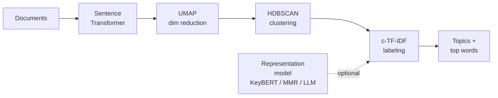

---
tags:
  - nlp
  - algorithm
  - topic-modeling
  - unsupervised
aliases:
  - BERTopic
---

[BERTopic](https://arxiv.org/abs/2203.05794) is a modular topic modeling pipeline. Instead of being a single generative model, it composes four independently swappable steps: embed, reduce, cluster, and label. The label step uses a class-based variant of TF-IDF that was introduced specifically for cluster-derived topics.

For the broader picture (when BERTopic makes sense versus [[LDA]], NMF, or just clustering), see the [[Topic Modeling]] hub.

## Pipeline



1. Embed documents. Default: `all-MiniLM-L6-v2` via `sentence-transformers`. Any embedding model is acceptable: domain-specific encoders often outperform general-purpose ones.
2. Reduce dimensionality. UMAP (Uniform Manifold Approximation and Projection) is commonly used here because it tends to preserve neighborhood structure useful for clustering. Typical target: 5–10 dimensions.
3. Cluster with HDBSCAN (Hierarchical Density-Based Spatial Clustering of Applications with Noise). Density-based; does not require $K$; assigns outlier documents to cluster `-1` instead of forcing them into a topic.
4. Extract topic words with c-TF-IDF (see below).
5. (Optional) Fine-tune representations using a representation model (`KeyBERTInspired`, `MaximalMarginalRelevance`, or an LLM) to replace c-TF-IDF output with more descriptive labels.

Each step is a constructor argument, so any embedding model, reducer, clusterer, or vectorizer can be swapped in without rewriting the rest. Practitioners commonly cite this modularity when comparing BERTopic to earlier neural topic models.

## c-TF-IDF

Class-based TF-IDF treats each cluster as a single concatenated document, then computes TF-IDF across clusters. The version currently implemented in BERTopic (since late 2022) uses additive smoothing inside the log:

$$c\text{-TF-IDF}_{t,c} = \frac{tf_{t,c}}{\sum_{t'} tf_{t',c}} \cdot \log\!\left(1 + \frac{A}{f_t}\right)$$

where:

- $tf_{t,c}$: frequency of term $t$ in cluster $c$
- $\sum_{t'} tf_{t',c}$: total words in cluster $c$ (L1 normalization of the term-frequency vector)
- $A$: average number of words per cluster
- $f_t$: total frequency of term $t$ across all clusters

The current implementation uses additive smoothing in the IDF-style term. The result: words that are frequent in this cluster and relatively rare across all clusters.

> [!note]
> The original 2022 paper and earlier versions of the library used $\log(m / \sum_i tf_{t,i})$ where $m$ is the number of classes. Older references citing that formula describe the same idea, just without the smoothing that the current library applies.

BERTopic also supports a BM25-weighted variant via `bm25_weighting=True` in `ClassTfidfTransformer`, which can help when class sizes are very uneven. A separate `reduce_frequent_words=True` option applies sub-linear TF scaling (`sqrt(tf)` instead of `tf`), which dampens the effect of corpus-generic high-frequency terms.

## Key features

- Dynamic topics (`.topics_over_time()`): recalculates c-TF-IDF per time bin; simpler than a true [[Topic Modeling Methods#Dynamic Topic Models|Dynamic Topic Model]] but not a generative model.
- Hierarchical topic merging: post-hoc agglomerative merging based on topic similarity; allows exploration of granularity without retraining.
- Guided BERTopic: seed a topic with a list of representative words; the pipeline biases clusters toward those seeds.
- Online / incremental mode: `.partial_fit` supports streaming updates; `merge_models` combines models trained on different subsets.
- Soft assignment: `.approximate_distribution()` returns per-document topic probabilities instead of a single hard cluster ID. Useful for mixed-membership-style outputs.
- LLM-based representation models: pass an `OpenAI` or `LangChain` representation model to replace c-TF-IDF labels with LLM-generated ones. See [[Topic Modeling Methods#LLM-assisted Topic Discovery|LLM-assisted topic discovery]].

For visual examples of these features, the [BERTopic visualization docs](https://maartengr.github.io/BERTopic/getting_started/visualization/visualization.html) walk through `.visualize_topics()` (intertopic distance map), `.visualize_hierarchy()`, and `.visualize_topics_over_time()`.

## Failure modes

- UMAP is stochastic, so different runs produce different topic counts. Fix `random_state` for reproducibility.
- HDBSCAN's noise cluster can absorb too many documents. Common adjustments: lower `min_cluster_size` and/or `min_samples`.
- Topics inherit embedding model biases. Mitigations: switch to a domain-relevant encoder, fine-tune the encoder on the target corpus, or use task-specific encodings.

## Inductive inference on new documents

BERTopic's `transform()` assigns a topic to a new document in three steps: embed the document with the fitted encoder, project through the fitted UMAP (via `transform`, not `fit_transform`), then call HDBSCAN's `approximate_predict` to get the closest cluster. HDBSCAN uses the condensed cluster tree from training: it is not a centroid-based method, so the assignment reflects density structure rather than distance to a cluster mean. For soft assignment, `.approximate_distribution()` returns a topic-probability vector per document via a sliding window over tokens, independent of the HDBSCAN model. Either path is typically one to two orders of magnitude faster than [[LDA]]'s folding-in at inference time.


## Mixed membership

BERTopic returns a single topic per document by default. This is less natural than LDA when a document genuinely mixes multiple themes at once. `.approximate_distribution(docs)` returns a topic-probability vector per document, computed via a sliding window over tokens. It's a post-hoc approximation, not a probabilistic model, but it's usually enough to identify documents with meaningful secondary topics.

## Guided BERTopic

When some topics are known to exist in advance, pass a list of seed-word lists:

```python
seed_topic_list = [
    ["loan", "credit", "mortgage", "interest"],
    ["team", "game", "match", "score"],
]
topic_model = BERTopic(seed_topic_list=seed_topic_list)
```

The pipeline biases the vectorizer and c-TF-IDF computation toward these seeds, increasing the chance that a topic containing those anchor words emerges. Other topics are discovered freely. Useful when domain knowledge is partial and the project needs guaranteed coverage of known categories without full supervision.

## Advantages and disadvantages

Advantages: minimal preprocessing (the transformer handles semantics), automatic $K$ via HDBSCAN, many features (dynamic / hierarchical / guided / online modes in one library).

Disadvantages: hard clustering by default (soft assignment requires an extra `.approximate_distribution()` step), computationally heavier than classical methods, UMAP memory grows roughly quadratically, embedding quality is a bottleneck in specialized domains.

> [!example]- Code example (BERTopic with LLM-based topic labels)
> ```python
> from bertopic import BERTopic
> from bertopic.representation import OpenAI, KeyBERTInspired
> from sentence_transformers import SentenceTransformer
> from sklearn.datasets import fetch_20newsgroups
> import openai
>
> docs = fetch_20newsgroups(
>     subset="all", remove=("headers", "footers", "quotes")
> )["data"]
>
> embedding_model = SentenceTransformer("all-MiniLM-L6-v2")
>
> # Option 1: lightweight representation tuning via KeyBERT
> representation_model = KeyBERTInspired()
>
> # Option 2: LLM-generated labels (uncomment to use)
> # client = openai.OpenAI()
> # representation_model = OpenAI(client, model="gpt-4o-mini", chat=True)
>
> topic_model = BERTopic(
>     embedding_model=embedding_model,
>     representation_model=representation_model,
>     min_topic_size=20,
>     random_state=42,
>     verbose=True,
> )
> topics, probs = topic_model.fit_transform(docs)
>
> # Inspect top topics
> print(topic_model.get_topic_info().head(10))
>
> # Soft assignment for mixed-membership-style outputs
> topic_distr, _ = topic_model.approximate_distribution(docs[:100])
>
> # Inference on new documents (no retraining)
> new_docs = ["The central bank raised rates again."]
> new_topics, _ = topic_model.transform(new_docs)
> ```

## Links

- [Grootendorst — BERTopic: Neural topic modeling with a class-based TF-IDF procedure (2022)](https://arxiv.org/abs/2203.05794)
- [BERTopic documentation](https://maartengr.github.io/BERTopic/)
- [BERTopic c-TF-IDF source code](https://github.com/MaartenGr/BERTopic/blob/master/bertopic/vectorizers/_ctfidf.py)
- [BERTopic visualization gallery](https://maartengr.github.io/BERTopic/getting_started/visualization/visualization.html)
- [BERTopic guided topic modeling guide](https://maartengr.github.io/BERTopic/getting_started/guided/guided.html)
- [sentence-transformers library](https://www.sbert.net/)
- [UMAP documentation](https://umap-learn.readthedocs.io/)
- [HDBSCAN documentation](https://hdbscan.readthedocs.io/)
