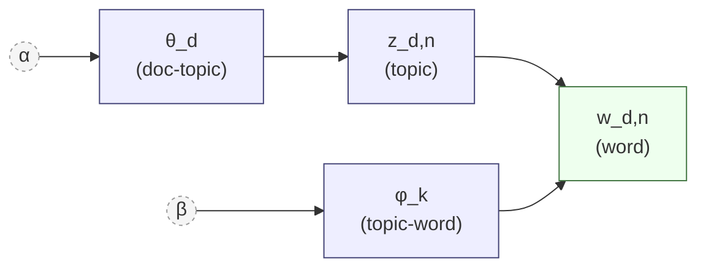

---
tags:
  - nlp
  - algorithm
  - topic-modeling
  - unsupervised
aliases:
  - Latent Dirichlet Allocation
  - LDA
---
Latent Dirichlet Allocation ([Blei, Ng, Jordan, 2003](https://www.jmlr.org/papers/volume3/blei03a/blei03a.pdf)) is the canonical probabilistic topic model. It fixes the overfitting of its predecessor [[Topic Modeling Methods#Probabilistic LSA (pLSA)|pLSA]] by placing Dirichlet priors on both the document-topic and topic-word distributions. Every modern topic model still gets compared to LDA as a baseline.

For the broader picture — when LDA makes sense versus other methods — see the [[Topic Modeling]].

## Generative process

> [!info] Generative process
> A generative process is a recipe for making synthetic data. LDA posits that each document in the corpus was produced by sampling from a specific hierarchy of distributions. Inference inverts the recipe: given the observed words, recover the most likely distributions that generated them.

> [!info] Dirichlet distribution
> A distribution over distributions on the $K$-dimensional simplex. A sample from $\text{Dir}(\alpha)$ is a probability vector $(\theta_1, \dots, \theta_K)$ with $\sum_k \theta_k = 1$. The concentration parameter $\alpha$ controls sparsity: small $\alpha$ (< 1) makes most of the mass sit on a few components; large $\alpha$ (> 1) produces nearly uniform vectors.

**Generative story:**

1. For each topic $k = 1, \dots, K$: draw a word distribution $\phi_k \sim \text{Dir}(\beta)$
2. For each document $d$:
   - Draw a topic distribution $\theta_d \sim \text{Dir}(\alpha)$
   - For each word position $n = 1, \dots, N_d$:
     - Sample a topic $z_{d,n} \sim \text{Multinomial}(\theta_d)$
     - Sample a word $w_{d,n} \sim \text{Multinomial}(\phi_{z_{d,n}})$

Dependency structure:



Formal plate notation (with $D$ documents, $K$ topics, $N_d$ words per document) is the standard way to draw this in the literature — see the [Wikipedia LDA page](https://en.wikipedia.org/wiki/Latent_Dirichlet_allocation#Model) for the canonical figure.

## Inference

Inference recovers the hidden $\theta_d$ and $\phi_k$ from the observed words. Three common approaches:

- Collapsed Gibbs sampling — analytically integrates out $\theta$ and $\phi$, then iteratively reassigns each word's topic by sampling from the conditional posterior. Used in Mallet and Gensim's `LdaModel`. More accurate, but slow on large corpora.
- Variational Bayes — approximates the posterior with a tractable family and optimizes the Evidence Lower Bound (ELBO). Used in scikit-learn. Faster, but the approximation can bias results.
- Online Variational Bayes ([Hoffman et al., 2010](https://papers.nips.cc/paper/2010/hash/71f6278d140af599e06ad9bf1ba03cb0-Abstract.html)) — processes documents in mini-batches, enabling streaming updates. The default for `LdaModel` in recent Gensim versions.

Mallet is often preferred when users want collapsed Gibbs sampling and are willing to trade speed for topic quality.

## Hyperparameters

| Parameter                            | Meaning                      | Default      | Effect                                                      |
| ------------------------------------ | ---------------------------- | ------------ | ----------------------------------------------------------- |
| $K$                                  | number of topics             | must specify | too few → merged themes; too many → duplicated topics       |
| $\alpha$                             | document-topic concentration | $1/K$        | low (0.01–0.1) → each document concentrates on a few topics |
| $\beta$ /$\eta$/eta/topic_word_prior | topic-word concentration     | $1/V$        | low → each topic concentrates on a few characteristic words |

For short texts (tweets, product titles), default $\alpha$ produces near-uniform topic distributions and renders the model useless. Manually set $\alpha$ below default and consider letting Gensim auto-tune it (`alpha='auto'`).

## Why counts instead of TF-IDF

LDA is a probabilistic generative model over words sampled from multinomial distributions, which means the math requires integer counts. TF-IDF values are real-valued weights, so they don't fit the generative story. Using TF-IDF with LDA technically works but typically gives worse topics than raw counts.

Contrast with [[Topic Modeling Methods#Non-negative Matrix Factorization (NMF)|NMF]], which is a matrix factorization objective with no distributional assumptions, so TF-IDF works well there.

## Inductive inference on new documents

LDA uses folding-in: freeze the topic-word distributions $\phi_k$ learned during training, then run variational inference (or a few Gibbs sweeps) on the new document alone to infer its topic distribution $\theta_{\text{new}}$.  Contrast with [[BERTopic]], where assignment is a single nearest-centroid lookup after the embedding is computed.

## Guided and supervised variants

Real-world projects often have partial domain knowledge — you know one topic should be about "payments" and another about "refunds", and you want the model to respect that.

- Seeded/Guided LDA — pre-set a few words per topic as anchors. The model is biased toward producing topics that contain those anchor words, while still discovering the remaining topics freely. Python library: `GuidedLDA`.
- CorEx (Correlation Explanation) — not strictly LDA, but an information-theoretic alternative that accepts anchor words per topic and is often easier to steer than Seeded LDA. Library: `corextopic`.
- Labeled LDA / SLDA — supervised variants that condition topics on document labels. Useful when you have partial labels and want topic discovery within each labeled group.

If you mainly want interpretable themes biased by a seed list, CorEx is frequently the best starting point; if you want a probabilistic LDA-style model with anchors, use Seeded LDA.

## Advantages and disadvantages

**Advantages:** theoretically grounded, interpretable per-document topic mixtures, well-studied, cheap to train and serve compared to embedding-based methods, mature library support.

**Disadvantages:** must pre-specify $K$, bag-of-words ignores word order, results vary across runs (Gibbs sampling is stochastic — fix the random seed for reproducibility), sensitive to preprocessing, struggles on short texts, cannot capture semantic similarity (for LDA, "car" and "automobile" are just two unrelated tokens).

## When LDA still earns its keep

- You want explicit probabilistic per-document topic mixtures (not hard cluster assignments).
- Your documents are medium-length and well-formed (news articles, papers, reports).
- You need a model that's cheap to train and serve, with predictable inference cost per document.
- You have an established pipeline and changing tools would cost more than improving LDA.
- You want topic distributions as features for a downstream classifier — LDA's $\theta_d$ vectors are natural inputs.

When LDA fails, the next steps are: NMF (for cleaner topics on short/noisy text), BERTopic (for semantic similarity), or ETM (for large vocabularies with rare words).

> [!example]- Code example (gensim, including folding-in for new documents)
> ```python
> from gensim import corpora
> from gensim.models import LdaMulticore
> from gensim.parsing.preprocessing import preprocess_string
>
> # --- Train ---
> docs = [preprocess_string(d) for d in train_corpus]
> dictionary = corpora.Dictionary(docs)
> dictionary.filter_extremes(no_below=5, no_above=0.8)
> corpus = [dictionary.doc2bow(doc) for doc in docs]
>
> lda = LdaMulticore(
>     corpus=corpus,
>     id2word=dictionary,
>     num_topics=20,
>     alpha='symmetric',
>     eta='auto',
>     passes=10,
>     random_state=42,
> )
>
> # Top words per topic
> for i, topic in lda.print_topics(num_words=10):
>     print(f"Topic {i}: {topic}")
>
> # --- Folding-in: infer topics for a NEW document without retraining ---
> new_doc = preprocess_string("The central bank raised rates again.")
> new_bow = dictionary.doc2bow(new_doc)
> new_topics = lda[new_bow]  # list of (topic_id, probability)
> print(new_topics)
> ```

### Links

- [Blei, Ng, Jordan — Latent Dirichlet Allocation (2003)](https://www.jmlr.org/papers/volume3/blei03a/blei03a.pdf)
- [Hoffman, Blei, Bach — Online Learning for Latent Dirichlet Allocation (2010)](https://papers.nips.cc/paper/2010/hash/71f6278d140af599e06ad9bf1ba03cb0-Abstract.html)
- [Gensim LDA documentation](https://radimrehurek.com/gensim/models/ldamulticore.html)
- [GuidedLDA — seeded LDA implementation](https://github.com/vi3k6i5/GuidedLDA)
- [CorEx topic modeling library](https://github.com/gregversteeg/corex_topic)
- [Mallet — Java toolkit, Gibbs-sampling LDA](https://mimno.github.io/Mallet/topics)
- [Wikipedia — Latent Dirichlet Allocation (plate notation figure)](https://en.wikipedia.org/wiki/Latent_Dirichlet_allocation)
