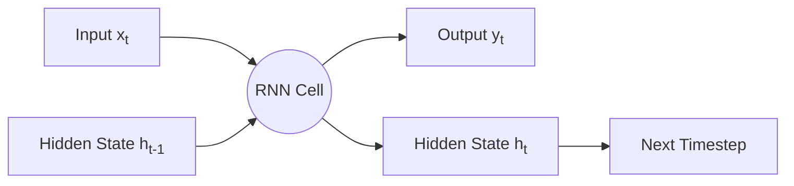

---
aliases:
  - RNN
  - Recurrent Neural Net
tags:
  - algorithm
  - model
  - architecture
  - nlp
---
Recurrent Neural Networks are a type of neural networks designed for processing sequential data. Unlike feedforward networks, RNNs have connections that form directed cycles, allowing them to maintain an internal state that captures information about previous inputs in a sequence.

The core idea behind RNNs is to process sequential data one element at a time while maintaining information about previous elements through a hidden state.

### RNN Architecture
At each time step t, a basic RNN cell:
1. Takes the current input $x_t$ and previous hidden state $h_{t-1}$
2. Computes a new hidden state $h_t$
3. Produces an output $y_t$

The mathematical formulation:
$h_t = \tanh \bigl(W_{xh} \, x_t + b_{xh} + W_{hh} \ h_{t-1} + b_{hh}\bigr)$
$y_t = \mathrm{softmax}\bigl(W_{hy} \, h_t + b_{hy}\bigr)$

### RNN Variants
* Bidirectional RNN processes sequences in both forward and backward directions to capture context from both past and future states.
* Deep (Stacked) RNN stacks multiple RNN layers on top of each other, with the output sequence of one layer forming the input sequence for the next.

## Common Problems
* Standard RNNs suffer from vanishing or exploding gradients during backpropagation through time, making them difficult to train on long sequences. The possible solutions are: gradient clipping, better weight initialization, specialized architectures like LSTM and GRU
* Standard RNNs struggle to capture long-range dependencies in sequences.

### LSTM Architecture

LSTMs solve the vanishing gradient problem by introducing a cell state and three gates:

Input Gate: Controls what new information to store
Forget Gate: Controls what information to discard
Output Gate: Controls what information to output

Mathematical formulation:

$f_t = \sigma\bigl(W_{xf}\, x_t + b_{xf} \;+\; W_{hf}\, h_{t-1} + b_{hf}\bigr)$
$i_t = \sigma\bigl(W_{xi}\, x_t + b_{xi} \;+\; W_{hi}\, h_{t-1} + b_{hi}\bigr)$
$\tilde{C}t = \tanh\bigl(W{xc}\, x_t + b_{xc} \;+\; W_{hc}\, h_{t-1} + b_{hc}\bigr)$
$C_t= f_t \,\odot\, C_{t-1} + i_t \,\odot$
$\tilde{C}to_t= \sigma\bigl(W{xo}\, x_t + b_{xo} \;+\; W_{ho}h_{t-1} + b_{ho}\bigr)$
$h_t = o_t \,\odot\, \tanh(C_t)$

## GRU Architecture

GRUs are a simplified variant of LSTMs with fewer parameters.
Update Gate: Combines input and forget gates
Reset Gate: Controls how much of previous state to forget

Mathematical formulation:
$z_t= \sigma \bigl(W_{xz}\, x_t + b_{xz} + W_{hz}\, h_{t-1} + b_{hz}\bigr)$
$r_t = \sigma \bigl(W_{xr}\, x_t + b_{xr} + W_{hr}\, h_{t-1} + b_{hr}\bigr)$
$\tilde{h}t = \tanh \bigl(W{xh}\, x_t + b_{xh} + r_t \odot (W_{hh}\, h_{t-1} + b_{hh})\bigr)$
$h_t = (1 - z_t) \odot h_{t-1} + z_t \odot \tilde{h}_t$

## Links
- [Colah's Blog: Understanding LSTM Networks](https://colah.github.io/posts/2015-08-Understanding-LSTMs/)
- [The Unreasonable Effectiveness of Recurrent Neural Networks](http://karpathy.github.io/2015/05/21/rnn-effectiveness/)
- [LSTM Original Paper](https://www.bioinf.jku.at/publications/older/2604.pdf)
- [GRU Paper](https://arxiv.org/abs/1406.1078)
- [PyTorch RNN Documentation](https://pytorch.org/docs/stable/generated/torch.nn.RNN.html)
