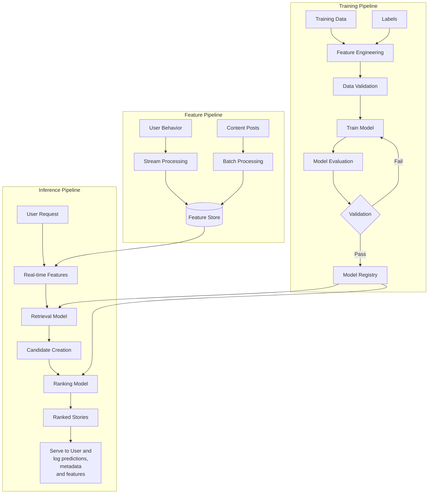

---
aliases:
  - RecSys
---
This note is similar to [[ML System design]] but it is more practical and with less focus on the interviews. This note is about practical approaches to developing a recommendation system.

Recommendation systems are a type of machine learning systems designed to suggest items to users based on their preferences, behavior, and context.
### Problem definition, scope and requirements
The business objective:
- Increasing user engagement and interaction time
- Driving more purchases or conversions
- Improving user retention and reducing churn
- Enhancing user experience and satisfaction
- Increasing content discovery and diversity
- Maximizing revenue per user

The business metrics:
* Click-Through Rate (CTR)
- Daily/Monthly Active Users (DAU/MAU)
- Session duration and depth
- Conversion rate
- Revenue per user
- Retention/churn rates
- Direct feedback from users (likes/dislikes, comments, complaints, surveys)
- Diversity of consumed content
- Customer Lifetime Value (LTV)
- Overall platform growth
- Brand satisfaction

The scope:
- Target users: all users or specific segments
- Item universe: entire catalog or specific categories
- Cold-start handling: separate solutions for new users/items
- Real-time requirements: immediate or batch processing
- Personalization level: group-based or individual

Performance-related questions:
- Real-time vs. batch predictions: Time-sensitive recommendations may require real-time processing, while others can use batch processing. It is possible to adopt a hybrid approach, for example, candidates could be predicted in batches and ranking could be done real-time
- Latency requirements: Maximum acceptable response time for recommendations
- Computing resources: CPU/GPU/memory needs for serving
- Scalability: Handling growing user base and item catalogs
- Caching strategy: Pre-computing common recommendations vs. on-demand calculation

### High-level design and diagrams
The specifics of a system will depend of the specific use case, but in general the design should include data collection for training, training flow (data collection, model training, deployment), the general logic of the pipeline in production.

### Candidate Generation and Ranking

Modern recommendation systems typically use a multi-stage approach:

1. Candidate Generation: Efficiently selecting a subset of items (hundreds to thousands) from the entire catalog (which might contain millions of items)
2. Ranking: Scoring and ordering these candidates to present the most relevant items first

This two-stage architecture helps balance computational efficiency with recommendation quality.

Initial candidate selection (before candidate generation) can be done using filtering rules, for example selecting items in the relevant location or time period. In case of reordering models, we select only the items that the user interacted with before.

The target variable is a certain action (view, click, order). Positive samples are cases when the user had a positive interaction with an item. [[Negative sampling]] is a separate topic, but in general we can sample randomly from all available candidates, sample items from the user history they didn't interact with or do in-batch sampling. For in-batch sampling, it can be important to apply [[logQ correction]] to tackle bias.
### Data preparation, analysis and feature engineering
For candidate generation/retrieval, modern approaches usually use [[Two tower]] architecture. It has separate towers for users and items.

Usually, the items are represented as [[embeddings]] for the item tower. Text descriptions can be embedded with any common embedder from the [MTEB: Massive Text Embedding Benchmark](https://huggingface.co/spaces/mteb/leaderboard) or by openai API. Images can be embedded using [[CLIP]]. 

User tower can have various ways of representing the users:
- Treating user_ids as separate tokens and training their embeddings from scratch. This is simple, but it is possible that there is not enough data; the "vocab" size could be too large and it won't generalize for the new users.
- Concatenate user features (demographic, location, any other data) and pass them through MLP - the output will be an embedding.
- Take the user history (last N items) and aggregate the item embeddings: averaging, averaging with attention, [[RNN]].
- Add contextual features: location, time of the day, day.

For ranking model, we need fine-grained features to capture the detailed preferences.

#### Data sources

There are mainly two sources of data: historical data of the previous interactions and the data logged during the predictions.

When a recommendation system makes predictions, we can log all the features, metadata and other information to use them in the models directly. The main benefit is that all the data is already actual at the moment of logging.

In practice, when we are only creating a new system, we need to take historical data, which could be captured at different time granularity. In this case it is crucial to process it carefully and prepare the data for training so that the features show actual values at the moment of the user-item interaction.
**User Data:**
- Explicit feedback: ratings, reviews, likes
- Implicit feedback: views, clicks, dwell time, purchase history
- Demographic information
- Search queries
- Device and context information

**Item Data:**
- Metadata: categories, tags, attributes
- Content features: text descriptions, images, videos
- Popularity metrics
- Creation time
- Price and availability

**Interaction Data:**
- User-item interactions (views, clicks, purchases)
- Timestamps, sequence information and other session-level information
- Context of interaction (device, location, time)

#### Feature engineering
The features may include: embedding extraction, user/item/creator features (numerical and categorical), metadata, context, graph-based features, interaction features, etc. 

**User Features**

- Demographics: Age, gender, location, language
- Behavioral Patterns: Active hours, session frequency, browsing patterns
- Interests: Categories frequently engaged with, short-term and long-term interests
- Time Gaps: Intervals between interactions
- Aggregated Interaction Statistics: Average rating, engagement frequency

**Item/content Features**

- Textual Features: Keywords, topics, the texts [[embeddings]]
- Visual Features: Image embeddings (for example, [[CLIP]])
- Popularity Metrics: Global popularity, popularity within segments, virality scores
- Temporal Features: Recency, seasonality
- Creator/Brand Features: Authorship, brand reputation, connections, categories
- Quality Indicators: Rating distribution, like-to-view ratio, comment sentiment

**User-item Interaction Features**
- Historical Interactions: Past engagement between user and similar items or the brand/creator
- Similarity Scores: Content similarity to previously liked items
- Collaborative Signals: Behavior of similar users
- Contextual Matches: Language/genre/topic alignment
- Social Graph Features: Friend interactions, network effects

**Contextual Features**
- Time Features: Time of day, day of week, seasonality
- Location Features: Geographic proximity, cultural relevance
- Device Features: Mobile vs. desktop, app vs. web
- Session Context: Current session length, previous interactions

Videos are usually are treated as a sequence of frames. Categories can be encoded or embedded.

### Models and evaluation

**Retrieval models:**
- Item-Item / User-User [[Collaborative Filtering]], [[Content-Based Filtering]]
- [[Matrix Factorization]]
- Clustering-based methods
- [[Two tower]] which is usually trained using [[contrastive learning]]

**Ranking models:**
- [[Logistic regression]], [[Gradient boosting]], [[Factorization Machines]]
- [[Deep Factorization Machines]]
- [[Neural Collaborative Filtering]]
- [[Deep & Cross Network]]
- [[Wide & Deep Learning]]
- [[Deep Interest Network]]
- [[Deep Learning Recommendation Model]]

Many recommendation systems optimize for more than one objective simultaneously (e.g. predicting clicks, likes, and long-term retention)

Often, ranking with models isn't enough:
- we may need to push certain advertised items
- we may need to diversify user recommendations to ensure we don't overexploit the same predictions

Usually, the model evaluation is performed on time-based evaluation split.

**Offline Evaluation:**
- Ranking Metrics: [[NDCG]]@k, [[MRR]], [[MAP]], [[Precision@k]], [[Recall@k]], Hit Rate
- Classification Metrics: [[AUC]], [[Accuracy]], [[Precision]], [[Recall]], [[f1 score]]
- Regression Metrics: [[RMSE]], [[MAE]]
- Diversity and Coverage Metrics: Item coverage, user coverage, category coverage
- Novelty and Serendipity Metrics: Unexpectedness, discovery rate

**Online Evaluation:**
- [[AB Tests]]: Comparing variants with controlled experiments
- User Satisfaction: Explicit feedback, surveys, qualitative assessment
### Cold start
**For New Users:**
- Non-personalized recommendations (popularity-based)
- Onboarding questionnaires to collect initial preferences
- Demographic-based recommendations
- Content-based recommendations based on explicit interests or demographics

**For New Items:**
- Content-based similarity to existing items
- Metadata-based matching
- Controlled exploration (showing new items to a subset of users)

### Deployment
**Data Storage and Processing:**
- Feature stores for efficient feature management
- Vector databases for embedding similarity search
- Stream processing for real-time events
- Batch processing for historical data

**Model Serving:**
- Low-latency serving infrastructure (TensorFlow Serving, TorchServe, Triton)
- Caching for common recommendations
- Load balancing and auto-scaling
- Quantization and model optimization for low-latency requirements

**Gradual Rollout:**
- Shadow deployment: Run model in parallel without affecting users
- Canary testing: Expose a small percentage of traffic to new model
- A/B testing: Compare performance against control
- Progressive rollout: Incrementally increase traffic to new model

### Post-deployment
**Monitoring and Alerting:**
- Model performance metrics: CTR, conversion, user engagement
- System performance: Latency, throughput, error rates
- Data quality: Distribution shifts, missing values
- Business metrics: Revenue, user satisfaction, model cannibalization

Scheduled retraining: Daily, weekly, or monthly updates

**Feedback Loop Management:**
- Bias correction in logged data
- Counterfactual evaluation
- Exploration policies to prevent feedback loops (force show diverse content, random exploration, bandits, simply insert random items into recommendations
)

### Links
- 
- [Instagram explore](https://ai.facebook.com/blog/powered-by-ai-instagrams-explore-recommender-system/)
- [TikTok recommendation](https://newsroom.tiktok.com/en-us/how-tiktok-recommends-videos-for-you)
- [Deep Neural Networks for YouTube Recommendations](https://storage.googleapis.com/pub-tools-public-publication-data/pdf/45530.pdf)
- [Wide & Deep Learning for Recommender Systems](https://arxiv.org/pdf/1606.07792.pdf%29/)
- 1. Snap's Spotlight system: https://eng.snap.com/embedding-based-retrieval
1. Instacart Search system: https://tech.instacart.com/how-instacart-uses-embeddings-to-improve-search-relevance-e569839c3c36
2. AirBnb Journey Ranker for Multi-stage ranking: https://arxiv.org/pdf/2305.18431
3. Muti-task RecSys: https://blog.reachsumit.com/posts/2024/01/multi-task-learning-recsys/
