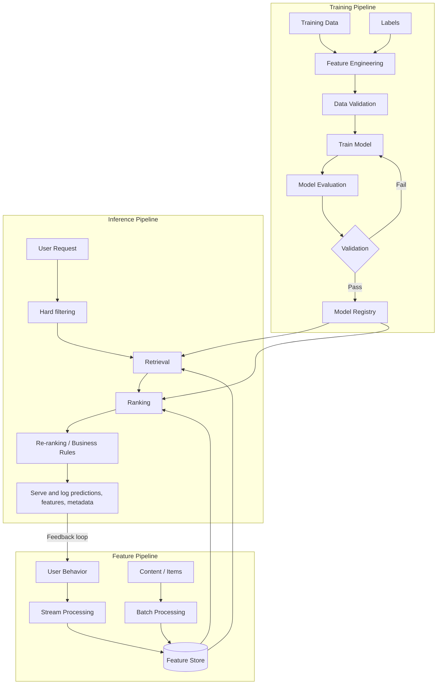

---
aliases:
  - RecSys
tags:
  - recsys
  - concept
prereqs:
  - "[[Two-tower]]"
  - "[[Calibration]]"
  - "[[Training-serving skew]]"
  - "[[Negative sampling]]"
  - "[[AB Tests]]"
---
This note covers how recommendation systems are designed, built, evaluated, deployed, and debugged in production. It overlaps with [[ML System design]] but focuses on practical engineering rather than interview framing.

Recommendation systems suggest items to users based on preferences, behavior, and context. In production, they are pipelines with retrieval, ranking, re-ranking, data preparation, experimentation, and monitoring around one or more models.

## Problem definition, scope, and requirements

### Business objective

- Increasing engagement and time spent
- Driving purchases or conversions
- Improving retention and reducing churn
- Improving discovery and catalog coverage
- Maximizing revenue or LTV per user

### Product questions

- What exactly are we recommending: products, videos, posts, ads, creators, notifications?
- Where is the recommendation shown: home feed, related items, search, emails, push?
- Is the goal retrieval, ranking, reordering an existing list, or all of them?
- Single objective or multiple?
- What constraints exist: freshness, fairness, safety, policy, legal, inventory, budget?
- Real-time adaptation required, or is batch scoring enough?
- Explicit, implicit, or mixed feedback?

### Business metrics

**Optimization metrics** — targets the system is tuned against:

- CTR, conversion rate, watch time, dwell time
- DAU / MAU, session depth, retention
- Revenue per user, GMV, LTV

**Guardrail metrics** — things that must not regress:

- Latency (P95 / P99)
- Error rate, content-policy violations
- Negative feedback: hide, dislike, report, unsubscribe
- Diversity and ecosystem concentration

CTR can rise while satisfaction or long-term retention falls.

### Scope

- Target users: all, a segment, or cold-start only
- Item universe: full catalog or a subset
- Cold-start regime: how many users or items are new on a given day
- Real-time vs batch: candidates are typically batch-friendly, ranking is typically real-time
- Personalization level: segment-level or individual

### Performance-related questions

- Acceptable P95 / P99 end-to-end latency
- Throughput and peak traffic
- CPU / GPU / memory limits
- Candidate set size at each stage
- Caching strategy: pre-compute for head users, compute on-demand for tail
- Fallback when features or models are unavailable

## High-level system design

Three pipelines (training, feature, and inference) form a closed loop through a model registry and a feature store: serving produces the user behavior that trains the next model. The inference pipeline runs a four-stage funnel: hard filtering, retrieval, ranking, re-ranking.

```mermaid
flowchart TD
    subgraph Training Pipeline
        direction TB
        TD[Training Data] --> FE[Feature Engineering]
        L[Labels] --> FE
        FE --> DV[Data Validation]
        DV --> TM[Train Model]
        TM --> ME[Model Evaluation]
        ME --> MV{Validation}
        MV -->|Pass| DR[Model Registry]
        MV -->|Fail| TM
    end

    subgraph Feature Pipeline
        direction TB
        UB[User Behavior] --> SP[Stream Processing]
        CP[Content / Items] --> BP[Batch Processing]
        SP --> FS[(Feature Store)]
        BP --> FS
    end

    subgraph Inference Pipeline
        direction TB
        UR[User Request] --> HF[Hard filtering]
        HF --> RET[Retrieval]
        RET --> RANK[Ranking]
        RANK --> RER[Re-ranking / Business Rules]
        RER --> Serve[Serve and log predictions, features, metadata]

        FS --> RET
        FS --> RANK
        DR --> RET
        DR --> RANK
    end

    Serve -->|Feedback loop| UB
```

## Multi-stage pipeline

### Funnel shape

An example of the funnel: catalog of 1M–100M items, retrieval narrows to 100–1000 candidates, ranking scores all of them, and the top 10–50 are shown.

### Hard filtering

Before the models, the candidate space is reduced with deterministic constraints:
- Locale, language, geography
- Availability and inventory
- Freshness or age window
- Policy and safety rules (a substantial subsystem in its own right, with its own classifiers, allowlists, and review loops)
- User-specific exclusions (already-seen, blocklist)

### Candidate generation and retrieval

Retrieval is recall-oriented; it aims to return a high-recall candidate set containing most items the ranker would place near the top.

Common retrievers:
- Popularity-based and recency-based baselines
- Item-item or user-user [[Collaborative Filtering]], [[Content-Based Filtering]]
- [[Matrix Factorization]]
- [[Two-tower]] trained with [[contrastive learning]]
- Graph retrievers for graph-structured catalogs
- Generative retrieval (emerging; some models generate item IDs autoregressively from user context)

Production systems often merge several retrieval sources: personalized, trending, fresh, exploratory. It can be necessary to deduplicate candidates and normalize the scores from different sources.

For embedding-based retrieval at scale, dot product over the full catalog is replaced by approximate nearest-neighbor search (FAISS, ScaNN, HNSW). Index refresh cadence determines how quickly new items become retrievable. 

### Ranking

Ranking scores candidates with a heavier model that can use more expensive features.

Common ranking models:

- [[Logistic regression]] (baseline) and [[Gradient boosting]] (LightGBM, Catboost or XGBoost)
- [[Deep & Cross Network]], [[Deep Learning Recommendation Model]]
- Sequential rankers (SASRec, HSTU): model user history as a sequence
- Multi-task architectures (Shared-Bottom, MMoE): one model predicts several targets with partially shared representations

When retrieval returns more candidates than the heavy ranker can score within the latency budget, a lightweight pre-ranker is added between the two stages to narrow the set (e.g., 10K → 1K).

Multi-task is common in production. A production ranker typically predicts several targets (click, dwell, like, conversion) with per-task heads and shared lower layers, and the final served score combines task scores. Common forms: weighted sum (`α·pCTR + β·pDwell + γ·pConv`) for additive blending, or multiplicative for value estimation (`pCTR × pConv × value`); weights are tuned against online metrics. MMoE adds per-task gating so tasks can specialize.

### Re-ranking

Re-ranking applies cross-item constraints and business logic, and may include full listwise optimization:

- Business rules: ad pacing, boost factors for new items, category quotas, blocklists
- Diversity: MMR and Determinantal Point Processes (DPP)
- Exploration slots: reserve a fraction of positions for under-explored items; with correctly logged propensities, these produce less policy-biased evaluation data
- Score combination: blend predictions from several rankers with different objectives
- Deduplication, safety filtering, inventory, and pacing logic

## Data and features

### Prefer logged features

When the live system makes a prediction, log every input feature, the prediction, and the metadata. Training on logged serving-time features greatly reduces point-in-time reconstruction errors and training-serving skew, but does not remove all sources of mismatch (feature-definition drift, missing logging, late-arriving updates, serving-only transformations still break parity).

Impression logging is important too: log each shown item with its position, candidate source, and the scores that produced it. This information is useful for exposure-bias correction, negative-example construction, and counterfactual evaluation.

### Point-in-time correctness

When there is no logging set up, you need to collect the data manually. Every feature must be computed using only data available before the interaction timestamp. A feature like `user_7d_click_count` that accidentally includes post-impression clicks is a leak. See [[Training-serving skew]] for the specific patterns: point-in-time joins, online/offline parity, staleness alignment, schema drift, shadow-log-and-diff.

### Feature examples

**User features:**

- Demographics: age, gender, location, language
- Behavioral patterns: active hours, session frequency, dwell distributions
- Interests: engaged categories, short-term vs long-term interest splits
- Recency: time since last interaction, inter-event gaps
- Aggregates: historical CTR, conversion rate, per-category engagement

**Item features:**

- Text via [[Word Embeddings]]
- Visual via [[Contrastive Language-Image Pre-training|CLIP]] or domain-specific image encoders
- Popularity: global, segment, virality, trending
- Temporal: item age, seasonality
- Creator or brand: authorship, quality score, historical CTR
- Quality: rating distribution, like-to-view ratio, comment sentiment

**User-item interaction features:**

- Past engagement between this user and this item, similar items, or the same creator
- Content similarity to previously-liked items
- Collaborative signals from similar users
- Contextual alignment: language, genre, topic match
- Retrieval-tower embeddings and their dot product

**Contextual features:**

- Time of day, day of week, local seasonality
- Device: mobile vs desktop, app vs web
- Session length, previous item, scroll position
- Geography

Video items are represented by metadata plus precomputed multimodal embeddings; usually done by frame-sequence models (attention, [[RNN]], transformer). High-cardinality categoricals (item IDs, creator IDs) get their own embedding tables, usually sharded.

### Feature-store schema split

Online feature stores can have various key types:

- User-keyed: profile, long-term aggregates, user embeddings
- Item-keyed: metadata, popularity, item embeddings
- User × item joined: historical cross-features, affinity scores

### Negative sampling

Positive samples are the actions users took. Negatives are chosen from non-interactions, where the label signal is ambiguous. The main choices: random from catalog (easy, weak), in-batch within a mini-batch (efficient, popularity-biased, mitigated by [[logQ correction]]), hard negatives from similar items (improves ranking, destabilizes training), and items shown but not clicked (even though the item may simply not have been noticed). "Not clicked" is a meaningful negative only when the item was actually exposed with a reasonable chance of being noticed; position and exposure bias contaminate it otherwise.

Strategies, trade-offs, and applications beyond recsys in [[Negative sampling]].

### Retrieval representations

Retrieval towers produce user and item embeddings that can be compared with dot product or cosine.

**Item tower inputs** typically combine:

- Learned ID embeddings
- Metadata embeddings
- Text embeddings
- Image or multi-modal embeddings
- Creator or brand features

**User tower inputs** typically combine:

- Learned user ID embedding
- Aggregated history: average of recent item embeddings, with or without attention
- Sequence model over interactions
- Static profile features through an MLP
- Short-term and long-term towers combined with gating

## Objectives, losses and calibration

Models are often trained on multiple objectives: CTR + dwell time, click + save + purchase, engagement + long-term retention, relevance + diversity + fairness. Combination approaches include multi-task learning with shared representations, a weighted sum of task scores at serving, cascaded models (one model's output feeds another), and separate models per surface.

Raw model scores are often miscalibrated. Calibration matters when scores feed into auctions, combine arithmetically (`pCTR × pConv × value`), or cross a probability threshold. Standard fixes are Platt scaling, isotonic regression, and temperature scaling. Calibration should be monitored per segment because it varies across country, device, and cohort, and drifts within each over time. See [[Calibration]].

## Evaluation

### Offline metrics

Always evaluate on a time-based split.

- Retrieval metrics: [[Recall@k]], Hit Rate@k, [[NDCG]]@k
- Ranking metrics: [[NDCG]]@k, [[MRR]], [[MAP]], [[Precision@k]], [[AUC]], log-loss
- Regression metrics: [[RMSE]], [[MAE]] for dwell-time or rating targets
- Coverage and diversity: item, user, and category coverage; intra-list diversity

It is a good idea to report not only overall metrics, but also metrics by segments/groups: country, device, user tenure, item type, and head vs tail.

### Counterfactual evaluation

Offline evaluation on logged data is biased: the log only contains items that the current serving policy chose. Counterfactual methods estimate how a candidate policy would behave using propensity corrections (IPS, doubly robust, replay). They break down when the candidate policy diverges far from the logging policy or when propensities are small. See [[Counterfactual evaluation]].

### Online evaluation

Controlled experiments are the standard online evaluation method. Online metrics to track:

- CTR, conversion, watch time, dwell time
- Session depth, retention, churn
- Negative feedback rate
- Revenue and marketplace effects
- Creator-side or seller-side effects
- Latency and stability guardrails

### A/B testing notes

Common A/B failures:

- **Interference.** Users in control see items shaped by treatment users in two-sided marketplaces or shared-inventory surfaces.
- **Novelty effects.** Users respond to novelty immediately, and it takes time for them to return to the stable state.
- **Triggered vs intent-to-treat analysis.** Compute impact on users who actually saw a different result, not on the full randomization bucket.
- **Surfacing changes.** Layout, thumbnail, caption, and slot count affect CTR independently of score order; treatments that change both surfacing and ranking together cannot isolate the ranker's contribution.

CUPED, peeking, long-term holdouts, ecosystem metrics, and heterogeneous effects are covered in [[AB Tests]].

## Specialized subproblems

### Cold start

Cold start has two sub-problems: new users (no interaction history to personalize against) and new items (no collaborative signal). New users can use context, onboarding signals, and bandits; new items can use content embeddings, creator priors, and guaranteed-exposure budgets. See [[Cold start]].

### Bias and feedback loops

A deployed recsys generates the data it will be trained on next. Popular items get more impressions, which produces more interactions, which pushes them higher in the next training cycle. The long tail collapses unless exploration forces diversity. Mitigations include exploration, IPS weighting during training, diversity constraints at re-ranking, and counterfactual evaluation before A/B. Position bias in click-trained rankers is commonly mitigated by modeling position as a feature during training and setting it to a constant at inference. See [[Bias and feedback loops]].

### Exploration vs exploitation

Every recommendation is a choice between a known-good item and an under-tested one. Pure exploitation maximizes short-term engagement but makes new items and users receive less signal; pure exploration wastes impressions. The approaches to handle this include: bandit policies for cold users, guaranteed-exposure budgets for cold items, exploration slots in re-ranking, and randomization during model rollouts. Without logged exploration data, the next training cycle only sees what the current policy preferred.

### Fairness and ecosystem health

Recommendations affect both users and the supply side (creators, sellers, content producers). Concentrating impressions on the head of the creator distribution reduces supply diversity over time, degrading the catalog and the user experience downstream. Typical metrics: Gini coefficient or HHI on creator impression share, new-creator impression rate, category and topic coverage. Fairness constraints enter at re-ranking (exposure caps, per-segment quotas) or as auxiliary training objectives. Users want relevance, creators want exposure, platforms want long-term ecosystem health.

## Deployment

### Data storage and processing

- Feature stores for consistent online and offline feature access
- Vector database or ANN index (FAISS, ScaNN, HNSW)
- Stream processing (Flink) for real-time events
- Batch processing (Spark) for historical aggregates
- Model registry and versioning

### Model serving

- Low-latency model servers
- Caching for head users and popular queries
- Load balancing and auto-scaling
- Quantization, pruning, and distillation on latency-sensitive paths
- Fallback when features or models are unavailable: use cached recommendations or the popularity baseline

### Gradual rollout

- Shadow deployment: compute predictions without serving them; diff against the champion
- Canary: route 1% of traffic to the new model for a fixed window
- A/B ramp-up: Incrementally move traffic to the new model
- Kill-switches tied to guardrail metrics (latency, error rate, engagement drop)

## Monitoring

### System

- P50 / P95 / P99 latency, error rate, throughput
- ANN recall against the exact top-k for the retrieval stage
- Feature freshness and missingness
- Cache hit rate
- Candidate counts and score distributions per retrieval source and per stage

### Model

- Online CTR, conversion, engagement, broken down by slice (country, device, user tenure, item type)
- Calibration drift per slice (ECE)
- Feature drift (PSI, KS) on each feature
- Prediction drift: distribution of model outputs; a sudden shift without a feature shift is usually an infra bug
- Embedding drift: cosine distance for the same items' (or users') embeddings across model versions

### Business

- Engagement, conversion, revenue
- Negative feedback: hide, report, unsubscribe
- Creator-side or seller-side impression share and concentration
- Cannibalization: new model steals clicks from existing models rather than generating incremental ones

### Data quality

- Broken joins and missing keys
- Impression logging gaps
- Label delays (conversions arrive hours to days after clicks; attribution windows must match between training and serving)
- Duplicated events
- Counter resets and schema changes

### Retraining

Frequency depends on content decay: daily or weekly for fast-moving content (news, social), weekly or monthly for slower-moving catalogs. An automated retraining pipeline includes:

- Data validation
- Feature validation
- Offline evaluation against the champion
- Calibration check
- Shadow serving
- Canary rollout

## Failure modes and debugging

### Common failure modes

- Same items for everyone: embedding collapse or over-reliance on popularity priors. Check embedding norm distributions and retrieval diversity.
- New items never served: new items aren't included in the actual ANN index
- Offline metrics increase, online metrics decrease: training-serving skew, label leakage, or novelty masking the real signal.
- Metrics improve, users complain: proxy metric (clicks) diverging from the true goal (satisfaction). Add a long-term holdout or survey-based metric.
- Recommendations worsen over time without system changes: feedback-loop collapse, upstream feature drift, or ANN index staleness.
- Latency spikes after a model update: feature logic changed.

### Debugging checklist

When a recommender degrades, useful questions:

- Did retrieval recall drop?
- Did a candidate source stop producing items?
- Did feature freshness degrade?
- Is there training-serving skew?
- Did item inventory or policy filters change?
- Did calibration drift?
- Did the serving distribution shift by geography, platform, or traffic source?
- Did the experiment trigger or logging change?
- Did the system switch to a fallback?

## Practical examples

- [Alibaba paper](https://arxiv.org/abs/1803.02349): user embeddings from random walks on session-level user-item interactions
- [Pinterest PinSAGE](https://arxiv.org/abs/1806.01973): graph convolutional networks at web scale
- [Meta DLRM](https://arxiv.org/abs/1906.00091): canonical large-scale ranking architecture
- [YouTube two-tower](https://research.google/pubs/pub48840/): reference implementation for two-tower retrieval at scale
